# CSE Data Asset — High-Level Documentation

> **Generated:** 2026-06-25 — validated 2026-06-25  
> **Sources:** `asset/cse-bau.yaml`, `asset/cde.yaml`, `asset/cloud-b.yaml` — verified against MaxCompute MCP  
> **Owner:** CSE Data Team  
> **Airflow:** `data-airflow.dana.id`  
> **Timezone:** Asia/Jakarta (WIB, UTC+7)

---

## Table of Contents

1. [High-Level Architecture](#1-high-level-architecture)
   - [1.1 Component Overview](#11-component-overview)
   - [1.2 System Context Diagram (C4 L1)](#12-system-context-diagram-c4-level-1)
   - [1.3 Container Diagram (C4 L2)](#13-container-diagram-c4-level-2)
   - [1.4 Component Diagram — Airflow (C4 L3)](#14-component-diagram--airflow-c4-level-3)
   - [1.5 Component Diagram — DataWorks CDE OBT (C4 L3)](#15-component-diagram--dataworks-cde-obt-c4-level-3)
   - [1.6 Data Flow Summary](#16-data-flow-summary)
   - [1.7 Key Design Decisions](#17-key-design-decisions)
2. [CSE BAU Pipeline](#2-cse-bau-pipeline)
   - [Pipeline 1 — Whitelist](#21-pipeline-1--whitelist)
   - [Pipeline 2 — Disable Asset](#22-pipeline-2--disable-asset)
   - [Pipeline 3 — Refresh Limit](#23-pipeline-3--refresh-limit)
   - [Pipeline 4 — Update Segment](#24-pipeline-4--update-segment)
   - [Pipeline 5 — Update Credit Type](#25-pipeline-5--update-credit-type)
   - [Pipeline 6 — CDE OBT Columnar Inject](#26-pipeline-6--cde-obt-columnar-inject)
3. [OBT Pipeline (CDE)](#3-obt-pipeline-cde)

---

## 1. High-Level Architecture

The CSE (Credit Scoring Engine) data platform orchestrates the flow of user credit data from upstream ANT Group and RISK team sources through MaxCompute transformation pipelines, ultimately delivering results to downstream LMS (Loan Management System) services via Airflow-managed injection DAGs.

### 1.1 Component Overview

| Component | Role | Details |
|---|---|---|
| **MaxCompute `dana_cloud_dwh`** | Internal DWH | CSE fact, mart, ADM, dim, ODS, and staging tables |
| **MaxCompute `ant_cloud_dwh`** | External source | ANT Group DANACICIL tables (whitelist, disable-asset, negative-handle) |
| **MaxCompute `risk_credit_dwh`** | External source | RISK team project — LSO data (list, disable_asset, refresh_limit, segment, credit_type) |
| **Apache Airflow** | Orchestrator | `data-airflow.dana.id` — 11 active DAGs (`credit_scoring_*`) |
| **DataWorks (Project 486)** | Scheduler | CDE OBT pipeline — user & account staging → ADM profile table → signal file writer |
| **LMS Backend** | Consumer | HTTP REST API at `loan-gateway.dana.id/v1.0/data/notify/submit` — receives whitelist delta & frozen-user notifications |
| **Postgres LMS** | Consumer | `member_retry_job` table — fed by refresh-limit, segment, and credit-type inject DAGs |
| **Hologres (Bright Prod)** | Consumer | Columnar store — `lending.c_adm_cse_cde_user_profile_dd` for live query serving |
| **DingTalk** | Alerting | Success/ failure notifications to CSE & on-duty DE channels |

### 1.2 System Context Diagram (C4 Level 1)

The System Context diagram shows the CSE Data Platform as a single system and its interactions with external actors and downstream systems.

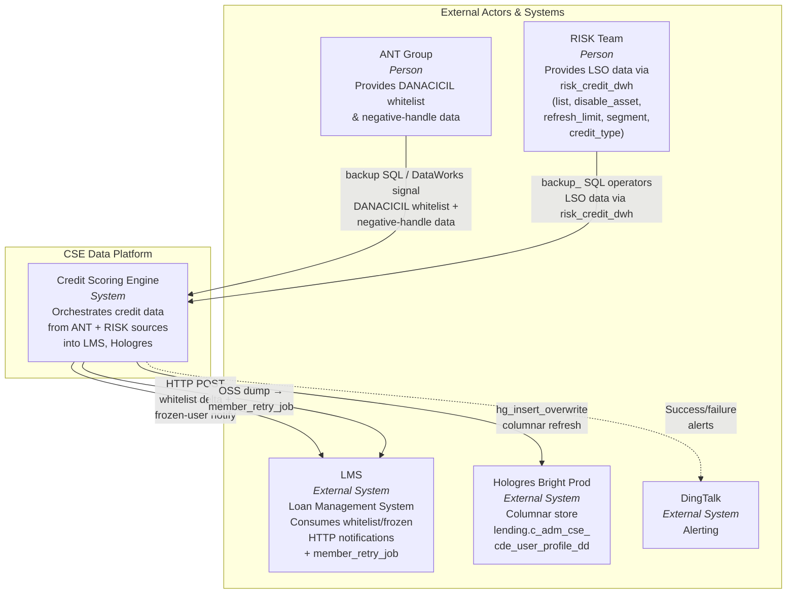

### 1.3 Container Diagram (C4 Level 2)

The Container diagram decomposes the CSE Data Platform into its major runtime containers and shows data flow between them.

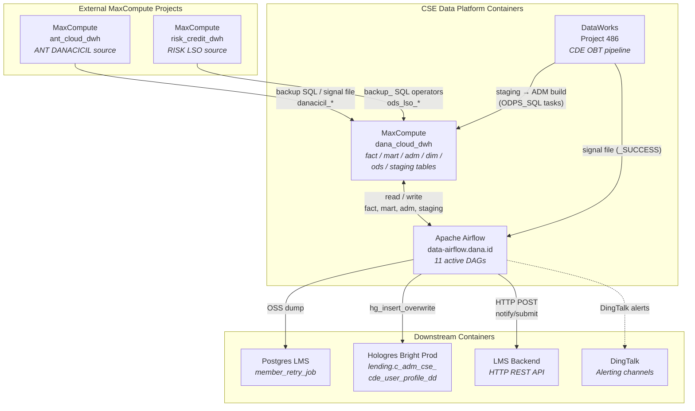

### 1.4 Component Diagram — Airflow (C4 Level 3)

Zooming into the **Apache Airflow** container, showing DAG groups, their MaxCompute data sources, ExternalTaskSensor dependencies, and downstream connections. BAU build DAGs trigger at 07:00 WIB; inject DAGs follow after configurable deltas.

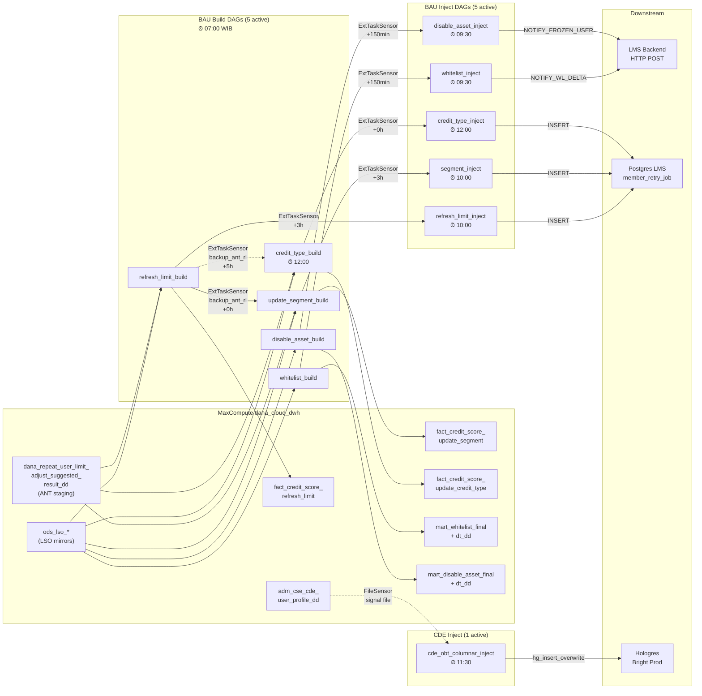

### 1.5 Component Diagram — DataWorks CDE OBT (C4 Level 3)

Zooming into **DataWorks Project 486**, showing the CDE OBT pipeline from upstream source tables through staging, data quality checks, ADM join, and signal-file emission. The Airflow `cde_obt_columnar_inject` DAG detects the signal file before refreshing Hologres.

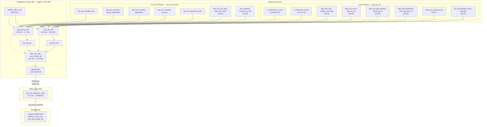

### 1.6 Data Flow Summary

| # | Source | Pipeline | Output Table | Inject Target | Schedule |
|---|---|---|---|---|---|
| 1 | ANT DANACICIL + RISK LSO | Whitelist | `mart_whitelist_final` | Hologres → LMS BE | 07:00 → 09:30 |
| 2 | ANT DANACICIL + RISK LSO | Disable Asset | `mart_disable_asset_final` | Hologres → LMS BE | 07:00 → 09:30 |
| 3 | ANT (via `dana_repeat_user_limit_adjust_suggested_result_dd`) + RISK LSO | Refresh Limit | `fact_credit_score_refresh_limit` | Postgres LMS | 07:00 → 10:00 |
| 4 | `dana_repeat_user_limit_adjust_suggested_result_dd` + RISK LSO | Update Segment | `fact_credit_score_update_segment` | Postgres LMS | 07:00 → 10:00 |
| 5 | `dana_repeat_user_limit_adjust_suggested_result_dd` + RISK LSO | Update Credit Type | `fact_credit_score_update_credit_type` | Postgres LMS | 12:00 → 12:00 |
| 6 | DataWorks CDE OBT | OBT Columnar | `adm_cse_cde_user_profile_dd` | Hologres Bright Prod | 11:00 → 11:30 (signal file) |

### 1.7 Key Design Decisions

- **SFTP dependencies removed** (June 2026): RISK team LSO data now flows directly from `risk_credit_dwh` into `dana_cloud_dwh` via `backup_` SQL operators inside build DAGs. No external SFTP wait is required for LSO (`ods_lso_*`) tables. ANT DANACICIL data (whitelist, negative-handle) is detected via DataWorks-written signal files (`FileSensor`), not SFTP file transfers.
- **Build-Inject DAG separation**: Each pipeline is split into a build DAG (`_build_`) that writes MaxCompute tables and an inject DAG (`_inject_`) that pushes results to downstream systems. This isolates failures and allows independent retry.
- **ANT data ingestion**: ANT DANACICIL whitelist data is read directly from `ant_cloud_dwh` tables. Disable-asset ANT data arrives through DataWorks-triggered signal files detected by Airflow `FileSensor` tasks. CDE OBT data flows through the DataWorks pipeline with a signal file gating Hologres injection.
- **CDE pipeline is DataWorks-managed**: The OBT build runs entirely within DataWorks (Project 486), with Airflow only handling the downstream Hologres injection via signal-file detection.
- **ANT refresh_limit staging**: The three ANT-sourced pipelines (refresh_limit, segment, credit_type) share a common staging table `dana_cloud_dwh.dana_repeat_user_limit_adjust_suggested_result_dd`, which is backed up daily from `ant_cloud_dwh` by the `backup_ant_refresh_limit` task. Each pipeline filters by a specific `flag` value: `update_limit` (refresh), `update_interest` (segment), `update_credit_type` (credit type). The segment and credit_type DAGs gate on `backup_ant_refresh_limit` task completion via `ExternalTaskSensor`.

---

## 2. CSE BAU Pipeline

The BAU (Business As Usual) pipeline consists of 5 core data flows, each with a **build DAG** (ETL to MaxCompute) and an **inject DAG** (push to downstream systems), plus a standalone CDE OBT columnar inject DAG.

### 2.1 Pipeline 1 — Whitelist

Builds the `mart_whitelist_final` table by joining ANT DANACICIL whitelist suggestions with RISK LSO list data, then notifies the LMS Backend of whitelist delta changes.

#### Flow Diagram

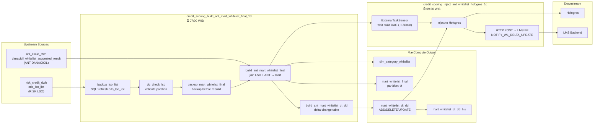

#### Tables

| Table | Type | Partition | Description |
|---|---|---|---|
| `dana_cloud_dwh.mart_whitelist_final` | mart | `dt` (daily) | Final whitelist — LSO list joined with ANT DANACICIL suggested results |
| `dana_cloud_dwh.mart_whitelist_dt_dd` | mart | `dt` | Delta-change table — tracks ADD, DELETE, UPDATE per user |
| `dana_cloud_dwh.mart_whitelist_dt_dd_his` | mart | — | Full history of all delta changes |
| `dana_cloud_dwh.dim_category_whitelist` | dim | — | Whitelist category dimension |
| `dana_cloud_dwh.ods_lso_list` | ods | — | LSO list mirror (refreshed from risk_credit_dwh via `backup_lso_list` SQL) |
| `ant_cloud_dwh.danacicil_whitelist_suggested_result` | external | — | ANT DANACICIL whitelist suggestion (read directly) |

#### Key Columns in `mart_whitelist_final`

| Column | Type | Description |
|---|---|---|
| `ip_role_id` | string | User ID of DANA customer |
| `phone_no` | string | Phone number of a user (PII) |
| `score` | string | Score band of a user based on probability |
| `limit` | string | Credit limit of a user |
| `category` | string | Category classification |
| `user_segment` | string | User segment that determines interest rate |
| `lender_product_id` | string | Lender ID of each user |
| `credit_type` | string | Revolving / non-revolving flag |
| `dt` | string | Date partition (daily) |

---

### 2.2 Pipeline 2 — Disable Asset

Processes frozen-user disable-asset notifications from ANT DANACICIL negative-handle data and RISK LSO disable-asset records, then notifies the LMS Backend.

#### Flow Diagram

```mermaid
flowchart LR
    subgraph UP["Upstream Sources"]
        ant_da["ant_cloud_dwh<br/>danacicil_negative_handle_loan_suggested_result_dd<br/>(ANT DANACICIL)"]
        lso_da["risk_credit_dwh<br/>ods_lso_disable_asset<br/>(RISK LSO)"]
    end

    subgraph BUILD["credit_scoring_build_ant_mart_disable_asset_final_1d<br/>⏰ 07:00 WIB"]
        backup_lso["backup_lso_disable_asset<br/>SQL: refresh ods_lso_disable_asset"]
        dq_lso["dq_check_lso<br/>validate partition"]
        wait_ant["wait_ant_disable_asset<br/>FileSensor: signal file from DataWorks"]
        backup_mart["backup_mart_disable_asset_final"]
        dq_bk_mart["dq_check_backup_mart"]
        dq_bk_ant["dq_check_backup_ant"]
        build["build_ant_mart_disable_asset_final<br/>join LSO + ANT → mart"]
        dq_mart["dq_check_mart_disable_asset_final"]
        build_dd["build_ant_mart_disable_asset_dt_dd<br/>delta-change table"]
        dq_dd["dq_check_mart_disable_asset_dt_dd"]
    end

    subgraph MC_OUT["MaxCompute Output"]
        mart_final["mart_disable_asset_final<br/>partition: dt"]
        mart_dd["mart_disable_asset_dt_dd<br/>delta changes"]
    end

    subgraph INJECT["credit_scoring_inject_ant_disable_asset_hologres_1d<br/>⏰ 09:30 WIB"]
        wait["ExternalTaskSensor<br/>wait build DAG (+150min)"]
        inject["inject to Hologres"]
        notify["HTTP POST → LMS BE<br/>NOTIFY_FROZEN_USER"]
    end

    subgraph DS["Downstream"]
        holo["Hologres"]
        lms["LMS Backend"]
    end

    lso_da --> backup_lso
    backup_lso --> dq_lso
    dq_lso --> backup_mart
    backup_mart --> dq_bk_mart
    dq_bk_mart --> dq_bk_ant
    ant_da --> wait_ant
    dq_bk_ant --> wait_ant
    wait_ant --> build
    build --> dq_mart
    dq_mart --> build_dd
    build_dd --> dq_dd
    build --> mart_final
    build_dd --> mart_dd

    dq_dd --> wait
    wait --> inject
    mart_dd --> inject
    inject --> holo
    inject --> notify
    notify --> lms

```

#### Tables

| Table | Type | Partition | Description |
|---|---|---|---|
| `dana_cloud_dwh.mart_disable_asset_final` | mart | `dt` (daily) | Frozen-user disable-asset records joined from LSO + ANT |
| `dana_cloud_dwh.mart_disable_asset_dt_dd` | mart | — | Delta-change table for disable-asset updates |
| `dana_cloud_dwh.ods_lso_disable_asset` | ods | — | LSO disable-asset mirror (refreshed via `backup_lso_disable_asset` SQL) |
| `ant_cloud_dwh.danacicil_negative_handle_loan_suggested_result_dd` | external | — | ANT DANACICIL negative-handle data (detected via DataWorks signal file FileSensor) |

#### Key Columns in `mart_disable_asset_final`

| Column | Type | Description |
|---|---|---|
| `account_id` | string | Account identifier |
| `ip_role_id` | string | User role identifier |
| `product_type` | string | Product type classification |
| `lender_product_id` | string | Lender product identifier |
| `disable_reason` | string | Reason for frozen-user / disable-asset status |
| `dt` | string | Partition date (daily) |

---

### 2.3 Pipeline 3 — Refresh Limit

Processes ANT credit-score refresh-limit suggestions combined with RISK LSO refresh-limit data, writing to a fact table and injecting into the Postgres LMS `member_retry_job` table. The `backup_ant_refresh_limit` task backs up `dana_repeat_user_limit_adjust_suggested_result_dd` from `ant_cloud_dwh` and also gates the downstream **Segment** and **Credit Type** pipelines.

#### Flow Diagram

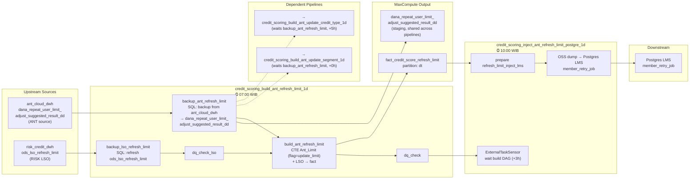

#### Tables

| Table | Type | Partition | Description |
|---|---|---|---|
| `dana_cloud_dwh.fact_credit_score_refresh_limit` | fact | `dt` (daily) | Final fact table — user-level refresh-limit scores and flags |
| `dana_cloud_dwh.dana_repeat_user_limit_adjust_suggested_result_dd` | staging | `dt` (daily) | ANT repeat-user limit/adjust suggestion backup — consumed by all three pipelines (refresh_limit, segment, credit_type) |
| `ant_cloud_dwh.dana_repeat_user_limit_adjust_suggested_result_dd` | external | `dt` (daily) | ANT source — raw limit-adjust suggestion data, backed up via `backup_ant_refresh_limit` SQL |
| `dana_cloud_dwh.ods_lso_refresh_limit` | ods | — | LSO refresh-limit mirror |
| `dana_cloud_dwh.refresh_limit_inject_lms` | staging | — | Prepared inject table for Postgres dump |

#### Key Columns in `fact_credit_score_refresh_limit`

| Column | Type | Description |
|---|---|---|
| `ip_role_id` | string | User role identifier |
| `flag` | string | User flag indicator |
| `category` | string | User category |
| `limit_old` | bigint | Previous credit limit |
| `limit_new` | bigint | New/updated credit limit |
| `product_id` | string | Lender product identifier |
| `account_id` | string | Account identifier |
| `dt` | string | Partition date (daily) |

---

### 2.4 Pipeline 4 — Update Segment

Resolves user lending-segment updates by joining the shared ANT staging table (filtered for `flag = 'update_interest'`) with RISK LSO segment data, producing a fact table and injecting into Postgres LMS.

#### Flow Diagram

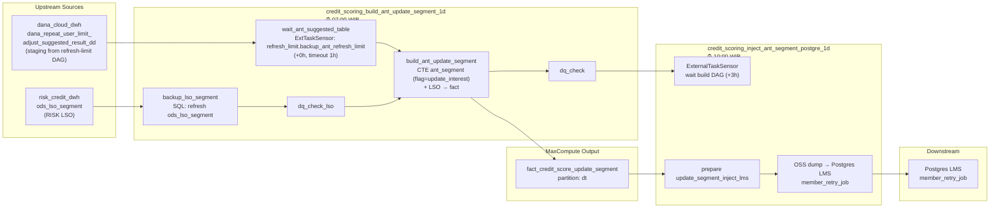

#### Tables

| Table | Type | Partition | Description |
|---|---|---|---|
| `dana_cloud_dwh.fact_credit_score_update_segment` | fact | `dt` (daily) | User-level segment update recommendations |
| `dana_cloud_dwh.dana_repeat_user_limit_adjust_suggested_result_dd` | staging | `dt` (daily) | Dependency — read from refresh-limit build DAG output (filtered for `flag = update_interest`) |
| `dana_cloud_dwh.ods_lso_segment` | ods | — | LSO segment mirror |
| `dana_cloud_dwh.update_segment_inject_lms` | staging | — | Prepared inject table for Postgres dump |

#### Key Columns in `fact_credit_score_update_segment`

| Column | Type | Description |
|---|---|---|
| `account_id` | string | Account identifier |
| `flag` | string | User flag indicator |
| `lender_product_id` | string | Lender product identifier |
| `approved_limit` | double | Approved credit limit for this segment |
| `user_segment` | string | Assigned user lending segment |
| `score` | string | User score band |
| `start_date` | string | Segment effective start date |
| `dt` | string | Partition date (daily) |

---

### 2.5 Pipeline 5 — Update Credit Type

Determines credit-type transitions (e.g., DACIL → DANACICIL swap-in/swap-out) using the shared ANT staging table (filtered for `flag = 'update_credit_type'`) and RISK LSO credit-type data. Runs later (12:00 WIB) due to the 5-hour delta on the upstream `backup_ant_refresh_limit` task.

#### Flow Diagram

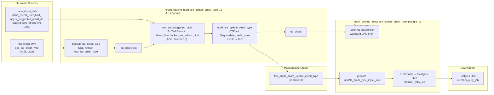

#### Tables

| Table | Type | Partition | Description |
|---|---|---|---|
| `dana_cloud_dwh.fact_credit_score_update_credit_type` | fact | `dt` (daily) | Credit-type change recommendations (swap-in/swap-out) |
| `dana_cloud_dwh.dana_repeat_user_limit_adjust_suggested_result_dd` | staging | `dt` (daily) | Dependency — read from refresh-limit build DAG (filtered for `flag = update_credit_type`) |
| `dana_cloud_dwh.ods_lso_credit_type` | ods | — | LSO credit-type mirror |
| `dana_cloud_dwh.update_credit_type_inject_lms` | staging | — | Prepared inject table for Postgres dump |

#### Key Columns in `fact_credit_score_update_credit_type`

| Column | Type | Description |
|---|---|---|
| `ip_role_id` | string | User role identifier |
| `account_id` | string | Account identifier |
| `lender_product_id` | string | Lender product identifier |
| `account_type` | string | Account type classification |
| `old_credit_type` | string | Previous credit product type (e.g., DACIL) |
| `new_credit_type` | string | New/target credit product type (e.g., DANACICIL) |
| `dt` | string | Partition date (daily) |

---

### 2.6 Pipeline 6 — CDE OBT Columnar Inject

A standalone Airflow DAG that waits for the CDE OBT table (built in DataWorks) via a signal file, then refreshes the Hologres columnar store for live query serving. This DAG is a consumer of the DataWorks-managed OBT pipeline (documented in §3).

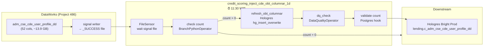

---

### BAU Schedule Timeline

```mermaid
gantt
    title CSE BAU Pipeline Daily Schedule (WIB)
    dateFormat HH:mm
    axisFormat %H:%M

    section Build DAGs
    whitelist_build        :wlb, 07:00, 120min
    disable_asset_build    :dab, 07:00, 120min
    refresh_limit_build    :rlb, 07:00, 120min
    update_segment_build   :usb, 07:00, 120min
    update_credit_type_build :ucb, 12:00, 120min

    section Inject DAGs
    whitelist_inject       :wli, 09:30, 120min
    disable_asset_inject   :dai, 09:30, 120min
    refresh_limit_inject   :rli, 10:00, 120min
    update_segment_inject  :usi, 10:00, 120min
    update_credit_type_inject :uci, 12:00, 120min

    section CDE
    cde_obt_columnar       :cde, 11:30, 120min
```

---

## 3. OBT Pipeline (CDE)

The CDE (Customer Data Engine) OBT (One Big Table) pipeline is a **DataWorks-managed** workflow that builds `adm_cse_cde_user_profile_dd`, the primary user profile table with 52 features for the credit decision engine. The Airflow DAG `credit_scoring_inject_cde_obt_columnar_1d` consumes the output for Hologres columnar serving.

All CDE OBT upstream source tables (both user-feature and account-feature sources listed in §3.1) reside in the `dana_cloud_dwh` MaxCompute workspace — with the sole exception of `inspect_dim_user` and `inspect_ods_lms_credit_limit`, which are DataWorks CHECK_NODE tasks rather than physical tables. See the note at the top of §3.1 for details.

### 3.1 Full Pipeline Flow

> **Note:** `inspect_dim_user` and `inspect_ods_lms_credit_limit` are **DataWorks CHECK_NODE tasks** (not physical MaxCompute tables). They verify upstream partition readiness — checking that the dependent source tables have fresh partitions before the staging build proceeds. These two nodes are the only non-table entries among the upstream dependencies in the diagram below.

```mermaid
flowchart TB
    subgraph UP["Upstream Sources (DataWorks, daily 00:00-06:00)"]
        subgraph USER_SRC["User Feature Sources → stg_user_dd"]
            a_score["t_riskmodel_a_score_v3_refit_new<br/>(monthly 5th)"]
            b_score["t_riskmodel_bscore_v2_refit_stable_new_repeat<br/>(7th & 21st)"]
            ktp_rel["adm_ktp_user_relation_summary<br/>(daily 00:16)"]
            greyout["dana_ab_score_greyout_list<br/>(daily 04:00)"]
            blacklist["adm_ctu_app_beyond_black_list_di<br/>(daily 03:00)"]
            ktp_bl["adm_ktp_blacklisted_user_summary_v2<br/>(daily 06:00)"]
            kyc["dwd_kyc_summary_dd<br/>(daily 00:27)"]
            pred["ds_risk_blacklist_score_fullscale<br/>(daily 00:12)"]
            dim_user["inspect_dim_user<br/>(daily 04:00, CHECK_NODE)"]
        end

        subgraph ACC_SRC["Account Feature Sources → stg_account_dd"]
            member_info["ods_lms_member_info"]
            lender_app["ods_lms_member_lender_application"]
            member_app["ods_lms_member_application"]
            member_acc["ods_lms_member_account"]
            payment["ods_lms_payment_order"]
            late_bills["dwd_evt_lms_late_days_bill_order<br/>(daily 00:04)"]
            dim_map["dim_mapping_account_id_user<br/>(daily 00:23)"]
            inspect["inspect_ods_lms_credit_limit<br/>(daily 00:00, CHECK_NODE)"]
        end
    end

    subgraph DW["DataWorks Pipeline (Project 486) -- triggers at 11:00 WIB"]
        start["START_OBT_CDE<br/>(VIRTUAL, task 10000260078)"]

        stg_user["adm_cse_cde_user_profile_stg_user_dd<br/>(ODPS_SQL, task 10000196789)<br/>24 columns, ~100 GB, lifecycle 5d"]
        stg_acc["adm_cse_cde_user_profile_stg_account_dd<br/>(ODPS_SQL, task 10000196790)<br/>25 columns, ~3.7 GB, lifecycle 5d"]

        dq_user["dq_stg_user_id_combined_report<br/>(ODPS_SQL, task 10000260103)"]
        dq_acc["dq_stg_acc_id_combined_report<br/>(ODPS_SQL, task 10000260121)"]

        adm_final["adm_cse_cde_user_profile_dd<br/>(ODPS_SQL, task 10000196791)<br/>52 columns, ~13.9 GB, ~2.78M rows<br/>partition: _pt_cr_month"]

        signal["signal writer<br/>(DI, task 10000196792)<br/>→ _SUCCESS file"]
    end

    subgraph AF["Airflow Consumer (11:30 WIB)"]
        inject["credit_scoring_inject_cde_obt_columnar_1d<br/>(ACTIVE)"]
    end

    subgraph DS["Downstream"]
        holo["Hologres Bright Prod<br/>lending.c_adm_cse_cde_user_profile_dd<br/>(columnar store)"]
    end

    %% User source → stg_user
    a_score --> stg_user
    b_score --> stg_user
    ktp_rel --> stg_user
    greyout --> stg_user
    blacklist --> stg_user
    ktp_bl --> stg_user
    kyc --> stg_user
    pred --> stg_user
    dim_user --> stg_user

    %% Account source → stg_account
    member_info --> stg_acc
    lender_app --> stg_acc
    member_app --> stg_acc
    member_acc --> stg_acc
    payment --> stg_acc
    late_bills --> stg_acc
    dim_map --> stg_acc
    inspect --> stg_acc

    %% DataWorks flow
    start --> stg_user
    start --> stg_acc
    stg_user --> dq_user
    stg_acc --> dq_acc
    dq_user --> adm_final
    dq_acc --> adm_final
    stg_user -.-> adm_final
    stg_acc -.-> adm_final
    adm_final --> signal

    %% Airflow consumption
    signal --> inject
    adm_final --> inject
    inject --> holo

    

```

### 3.2 OBT Tables

| Table | Type | Partition | Size | Rows | Lifecycle | Description |
|---|---|---|---|---|---|---|
| `adm_cse_cde_user_profile_dd` | adm | `_pt_cr_month` | ~13.9 GB | ~2.78M | permanent | **Final OBT** — joined user + account profile with 52 features |
| `adm_cse_cde_user_profile_stg_user_dd` | staging | `dt` (daily) | ~100 GB | — | 5 days | User-level staging — scores, flags, KYC, behavior, persona |
| `adm_cse_cde_user_profile_stg_account_dd` | staging | `dt` (daily) | ~3.7 GB | — | 5 days | Account-level staging — limits, DPD, segments, LMS data |
| `adm_cse_cde_segment_value_validation_check_dq` | adm | `dt` (daily) | minimal | — | 5 days | DQ validation: criteria JSON, status, failure reason |
| `ods_lms_holo_funnel_query_task_delta` | ods | `dt` + `hr` | ~52 KB | — | permanent | LMS funnel task criteria — fed by external `postgres2mc` DAG |

### 3.3 Key Columns in `adm_cse_cde_user_profile_dd` (52 columns)

The final ADM table joins `stg_user_dd` (user-level features) with `stg_account_dd` (account-level features) to produce 52 user-level columns partitioned by `_pt_cr_month` (monthly).

#### Identity & Demographics

| Column | Type | Description |
|---|---|---|
| `user_id` | string | Unique user identifier |
| `phone_no` | string | User phone number (PII) |
| `kyc_level` | string | KYC verification level |
| `dana_age_month` | bigint | DANA account age in months |
| `user_age` | bigint | User age |
| `ktp_province` | string | KTP-registered province |
| `ktp_city` | string | KTP-registered city |

#### Scores & Flags

| Column | Type | Description |
|---|---|---|
| `ant_a_score` | string | ANT Group A-score bucket |
| `ant_b_score` | string | ANT Group B-score bucket |
| `dana_a_score` | string | DANA internal A-score bucket |
| `dana_b_score` | string | DANA internal B-score bucket |
| `ab_blacklist_flag` | boolean | A/B blacklist indicator |
| `risk_blacklist_flag` | boolean | Risk blacklist indicator |
| `kyb_flag` | boolean | Know-Your-Business flag |
| `cicil_whitelist_flag` | boolean | Cicil whitelist eligibility |
| `instan_whitelist_flag` | boolean | Instan whitelist eligibility |
| `is_employee_flag` | boolean | DANA employee flag |
| `ktp_blacklist_flag` | boolean | KTP blacklist indicator |
| `good_user_score` | double | Good user scoring (from prediction model) |
| `scam_suspect_level` | string | Scam suspect risk level |

#### Persona & Behavior

| Column | Type | Description |
|---|---|---|
| `user_persona` | array\<string\> | User persona tags (e.g., new_user, loyal) |
| `total_attempts` | bigint | Total application/lending attempts |
| `count_device` | bigint | Number of associated devices |
| `consecutive_flag` | string | Consecutive transaction flag |
| `topup_only_flag` | string | Top-up only behavior flag |
| `receiver_only_flag` | string | Receiver-only behavior flag |
| `cd_only_flag` | string | Cash deposit only behavior flag |
| `cd_topup_receiver_only_flag` | string | Combined CD + topup + receiver only flag |
| `paylater_flag` | string | PayLater behavior flag |

#### Account Info

| Column | Type | Description |
|---|---|---|
| `account_id` | string | LMS account ID — join key to `stg_account_dd` |

#### Cicil Lending

| Column | Type | Description |
|---|---|---|
| `cicil_approved_flag` | boolean | Cicil lending approved status |
| `cicil_util` | double | Cicil utilization rate |
| `cicil_limit` | double | Cicil credit limit amount |
| `cicil_latest_lpi` | string | Latest Cicil lender product ID (LPI) |
| `cicil_latest_status` | string | Latest Cicil account status |
| `cicil_latest_segment` | string | Latest Cicil lending segment |
| `cicil_latest_dpd` | bigint | Latest Cicil days past due |
| `cicil_max_ever_dpd` | bigint | Maximum ever Cicil days past due |
| `cicil_mob_first_trx` | double | Cicil month-on-book at first transaction |
| `cicil_success_migrate_flag` | boolean | Cicil successful migration flag |

#### Instan Lending

| Column | Type | Description |
|---|---|---|
| `instan_approved_flag` | boolean | Instan lending approved status |
| `instan_util` | double | Instan utilization rate |
| `instan_limit` | double | Instan credit limit amount |
| `instan_latest_lpi` | string | Latest Instan lender product ID (LPI) |
| `instan_latest_status` | string | Latest Instan account status |
| `instan_latest_segment` | string | Latest Instan lending segment |
| `instan_latest_dpd` | bigint | Latest Instan days past due |
| `instan_max_ever_dpd` | bigint | Maximum ever Instan days past due |
| `instan_mob_first_trx` | double | Instan month-on-book at first transaction |
| `instan_success_migrate_flag` | boolean | Instan successful migration flag |

#### LMS Info

| Column | Type | Description |
|---|---|---|
| `lms_trx_success_flag` | boolean | LMS transaction success indicator |
| `lms_province` | string | LMS registered province |

### 3.4 CDE Schedule Timeline

```mermaid
gantt
    title CDE OBT Pipeline Daily Schedule (WIB)
    dateFormat HH:mm
    axisFormat %H:%M
    todayMarker off

    section Upstream Sources
    kyc_summary                     :kyc, 00:00, 27min
    late_bills                      :late, 00:00, 4min
    prediction_clone                :pred, 00:00, 12min
    ktp_relations                   :ktp, 00:00, 16min
    account_user_mapping            :map, 00:00, 23min
    lms_ods_tables                  :lms, 00:00, 28min
    ab_score_greyout                :grey, 00:00, 240min
    app_beyond_blacklist            :bl, 00:00, 180min
    ktp_blacklist                   :ktpbl, 00:00, 360min

    section DataWorks CDE OBT
    stg_user_dd_build               :stgu, 11:00, 60min
    stg_account_dd_build            :stga, 11:00, 60min
    dq_stg_user_check               :dqu, 12:00, 10min
    dq_stg_acc_check                :dqa, 12:00, 10min
    adm_cde_user_profile_build      :adm, 12:10, 30min
    signal_file_write               :sig, 12:40, 5min

    section Airflow Inject
    wait_signal_filesensor          :wait, 11:30, 70min
    cde_obt_columnar_inject         :inj, 12:45, 45min
```

### 3.5 Upstream Dependencies

The CDE OBT pipeline depends on **20+ upstream DataWorks tasks** from across the DANA data ecosystem:

| Domain | Source Tables | Refresh Time | Description |
|---|---|---|---|
| **ANT Scores** | `t_riskmodel_a_score_v3_refit_new`, `t_riskmodel_bscore_v2_refit_stable_new_repeat` | Monthly (5th, 7th/21st) | ANT Group A/B credit scores — gated by monthly refreshes |
| **KYC** | `dwd_kyc_summary_dd` | Daily 00:27 | KYC verification level summary per user |
| **Blacklist** | `adm_ctu_app_beyond_black_list_di`, `adm_ktp_blacklisted_user_summary_v2` | Daily 03:00 / 06:00 | App-level and KTP-level blacklist flags |
| **Greyout** | `dana_ab_score_greyout_list` | Daily 04:00 | A/B score greyout user list |
| **KTP Relations** | `adm_ktp_user_relation_summary` | Daily 00:16 | KTP-based user relation mapping |
| **Prediction** | `ds_risk_blacklist_score_fullscale` | Daily 00:12 | Latest prediction results (good_user_score source) |
| **LMS ODS** | `ods_lms_member_info`, `_application`, `_account`, `_lender_application`, `_payment_order` | Daily ~00:23 | Core LMS member and lending data |
| **Late Bills** | `dwd_evt_lms_late_days_bill_order` | Daily 00:04 | Late payment events (DPD source) |
| **Account Mapping** | `dim_mapping_account_id_user` | Daily 00:23 | Account ID to User ID lookup |
| **Funnel Tasks** | `ods_lms_holo_funnel_query_task_delta` | Via external `postgres2mc` DAG | Dynamic segment assignment criteria |

> **Note:** All data tables listed above reside in the `dana_cloud_dwh` MaxCompute workspace.  
> **Inspection nodes** (`inspect_dim_user` at 04:00 WIB, `inspect_ods_lms_credit_limit` at 00:00 WIB) gate the user-feature and account-feature groups respectively via DataWorks CHECK_NODE tasks — they are not physical MaxCompute tables. See §3.1 for details.

---

## Appendix: Full Asset Inventory Summary

### MaxCompute Tables (by type)

| Type | Count | Tables |
|---|---|---|
| **fact** | 3 | `fact_credit_score_refresh_limit`, `fact_credit_score_update_segment`, `fact_credit_score_update_credit_type` |
| **mart** | 6 | `mart_whitelist_final`, `mart_whitelist_dt_dd`, `mart_whitelist_dt_dd_his`, `mart_disable_asset_final`, `mart_disable_asset_dt_dd`, `mart_credit_score_whitelist_final` |
| **adm** | 4 | `adm_cse_cde_user_profile_dd`, `adm_cse_cde_segment_value_validation_check_dq`, `_bak`, `_wl_test` |
| **dim** | 1 | `dim_category_whitelist` |
| **ods** | 8 | `ods_lso_list`, `ods_lso_disable_asset`, `ods_lso_refresh_limit`, `ods_lso_segment`, `ods_lso_credit_type`, `ods_lms_holo_funnel_query_task_delta`, `ods_lms_holo_funnel_query_task`, `ods_creditscore_model_result` |
| **staging** | 7 | `dana_repeat_user_limit_adjust_suggested_result_dd`, `refresh_limit_inject_lms`, `update_segment_inject_lms`, `update_credit_type_inject_lms`, `adm_cse_cde_user_profile_stg_user_dd`, `adm_cse_cde_user_profile_stg_account_dd`, `_stg_user_bak` |
| **external** | 3 | `ant_cloud_dwh.danacicil_negative_handle_loan_suggested_result_dd`, `ant_cloud_dwh.danacicil_whitelist_suggested_result`, `dana_cloud_dwh.dwd_pty_mbr_role_member_dd` |

### Airflow DAGs

| Status | Count | DAG IDs |
|---|---|---|
| **active** | 11 | 5 BAU build + 5 BAU inject + 1 CDE OBT inject |
| **paused** | 2 | CDE segment build + inject |

### Downstream Systems

| System | Fed By | Data Type |
|---|---|---|
| **LMS Backend** | whitelist_hologres, disable_asset_hologres | HTTP POST notify |
| **Postgres LMS** | refresh_limit_postgre, segment_postgre, credit_type_postgre | OSS dump → `member_retry_job` |
| **Hologres Bright Prod** | inject_cde_obt_columnar | Columnar store refresh |
| **DingTalk** | All DAGs | Success/failure alerts |

---
*End of Document*