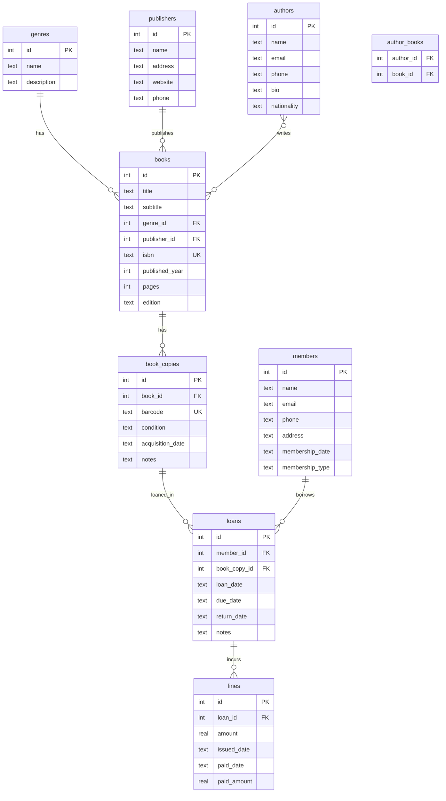

# Entity-Relationship Diagram (ERD)
## Library Management System Database

---

## Overview

This document shows the relationships between tables in the `library-db.sql` database.

---

## Entity Relationship Diagram

---

## Relationship Summary

| Relationship | Type | Description |
|--------------|------|-------------|
| `genres` → `books` | One-to-Many | A genre can have many books |
| `publishers` → `books` | One-to-Many | A publisher can publish many books |
| `authors` ↔ `books` | Many-to-Many | An author can write many books; a book can have multiple authors |
| `books` → `book_copies` | One-to-Many | A book can have multiple physical copies |
| `book_copies` → `loans` | One-to-Many | A book copy can be loaned multiple times |
| `members` → `loans` | One-to-Many | A member can borrow multiple books |
| `loans` → `fines` | One-to-Many | A loan can incur multiple fines |

---

## Table Details

### genres
| Column | Type | Constraints |
|--------|------|-------------|
| id | INTEGER | PRIMARY KEY |
| name | TEXT | NOT NULL |
| description | TEXT | |

### publishers
| Column | Type | Constraints |
|--------|------|-------------|
| id | INTEGER | PRIMARY KEY |
| name | TEXT | NOT NULL |
| address | TEXT | |
| website | TEXT | |
| phone | TEXT | |

### authors
| Column | Type | Constraints |
|--------|------|-------------|
| id | INTEGER | PRIMARY KEY |
| name | TEXT | NOT NULL |
| email | TEXT | |
| phone | TEXT | |
| bio | TEXT | |
| nationality | TEXT | |

### books
| Column | Type | Constraints |
|--------|------|-------------|
| id | INTEGER | PRIMARY KEY |
| title | TEXT | NOT NULL |
| subtitle | TEXT | |
| genre_id | INTEGER | FOREIGN KEY → genres(id) |
| publisher_id | INTEGER | FOREIGN KEY → publishers(id) |
| isbn | TEXT | UNIQUE |
| published_year | INTEGER | |
| pages | INTEGER | |
| edition | TEXT | |

### author_books (Junction Table)
| Column | Type | Constraints |
|--------|------|-------------|
| author_id | INTEGER | FOREIGN KEY → authors(id), PRIMARY KEY |
| book_id | INTEGER | FOREIGN KEY → books(id), PRIMARY KEY |

### book_copies
| Column | Type | Constraints |
|--------|------|-------------|
| id | INTEGER | PRIMARY KEY |
| book_id | INTEGER | FOREIGN KEY → books(id) |
| barcode | TEXT | UNIQUE |
| condition | TEXT | |
| acquisition_date | TEXT | |
| notes | TEXT | |

### members
| Column | Type | Constraints |
|--------|------|-------------|
| id | INTEGER | PRIMARY KEY |
| name | TEXT | NOT NULL |
| email | TEXT | |
| phone | TEXT | |
| address | TEXT | |
| membership_date | TEXT | NOT NULL |
| membership_type | TEXT | DEFAULT 'standard' |

### loans
| Column | Type | Constraints |
|--------|------|-------------|
| id | INTEGER | PRIMARY KEY |
| member_id | INTEGER | FOREIGN KEY → members(id) |
| book_copy_id | INTEGER | FOREIGN KEY → book_copies(id) |
| loan_date | TEXT | NOT NULL |
| due_date | TEXT | NOT NULL |
| return_date | TEXT | |
| notes | TEXT | |

### fines
| Column | Type | Constraints |
|--------|------|-------------|
| id | INTEGER | PRIMARY KEY |
| loan_id | INTEGER | FOREIGN KEY → loans(id) |
| amount | REAL | NOT NULL |
| issued_date | TEXT | NOT NULL |
| paid_date | TEXT | |
| paid_amount | REAL | |

---

## Key Relationships Explained

### Many-to-Many: Authors ↔ Books
The `author_books` junction table enables a many-to-many relationship:
- One author can write multiple books (e.g., George Orwell wrote 1984, Brave New World, Fahrenheit 451)
- One book can have multiple authors (future extensibility)

### One-to-Many: Books → Book Copies
A single book title can have multiple physical copies:
- Different copies have different barcodes (BK001A, BK001B)
- Copies can have different conditions

### One-to-Many: Members → Loans
A library member can borrow multiple books over time, but each loan is for one book copy.

### One-to-Many: Loans → Fines
A loan can incur fines (e.g., for late returns). Multiple fines can be issued to the same loan.

---

## Cardinality Notation

| Symbol | Meaning |
|--------|---------|
| `||` | Exactly one |
| `o|` | Zero or one |
| `}|` | One or more |
| `o{` | Zero or more |

---

*Document generated for Library Management System Database*