# 6-Month Data Engineering Roadmap
## From SQL Fundamentals to Agentic AI-Powered Pipelines

```
Start Date: July 2026
End Date: January 2027
Level: SQL Intermediate → Data Engineering Job-Ready
Time Commitment: 6-8 hours daily
Total Cost: $0 (using free tiers)
Tools: BigQuery, dbt Cloud, Airflow (Astro CLI), Docker, PySpark
LLM: Claude/Gemini Free Tier (for AI agents)
```

---

## Table of Contents

1. [Prerequisites & Setup](#prerequisites--setup)
2. [Overall Architecture](#overall-architecture)
3. [Phase 1: BigQuery + Advanced SQL](#phase-1-bigquery--advanced-sql-weeks-1-4)
4. [Phase 2: dbt Cloud](#phase-2-dbt-cloud-weeks-5-8)
5. [Phase 3: Airflow Orchestration](#phase-3-airflow-orchestration-weeks-9-12)
6. [Phase 4: PySpark](#phase-4-pyspark-weeks-13-16-skippable)
7. [Phase 5: Data Quality + AI Monitoring](#phase-5-data-quality--ai-monitoring-weeks-17-20)
8. [Phase 6: Agentic AI for DE](#phase-6-agentic-ai-for-de-weeks-21-24)
9. [Phase 7: Portfolio + Interview](#phase-7-portfolio--interview-weeks-25-26)
10. [Resources & References](#resources--references)
11. [Progress Tracking](#progress-tracking)

---

## Prerequisites & Setup

### Required Accounts (All Free)

| Tool | Purpose | Sign Up |
|------|---------|---------|
| GCP (Google Cloud) | BigQuery access | cloud.google.com |
| dbt Cloud | dbt development | cloud.getdbt.com |
| GitHub | Version control | github.com |
| Docker | Containerization | docker.com |
| Claude/Gemini | LLM for AI agents | anthropic.com / aistudio.google.com |

### Tools Installation

```bash
# Astro CLI (Airflow local)
curl -ssl https://install.astronomer.io | bash

# Docker Desktop (Windows)
# Download from https://docker.com/products/docker-desktop

# Python 3.11+ (for PySpark and AI agents)
# Download from https://python.org

# PySpark
pip install pyspark

# LangChain + Claude
pip install langchain langchain-anthropic
```

---

## Overall Architecture

### Complete Data Engineering Pipeline

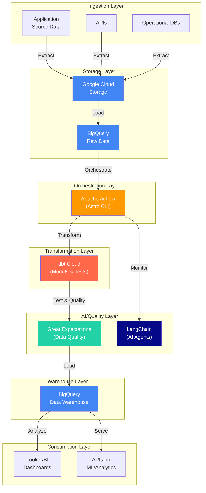

### Tool Integration Map

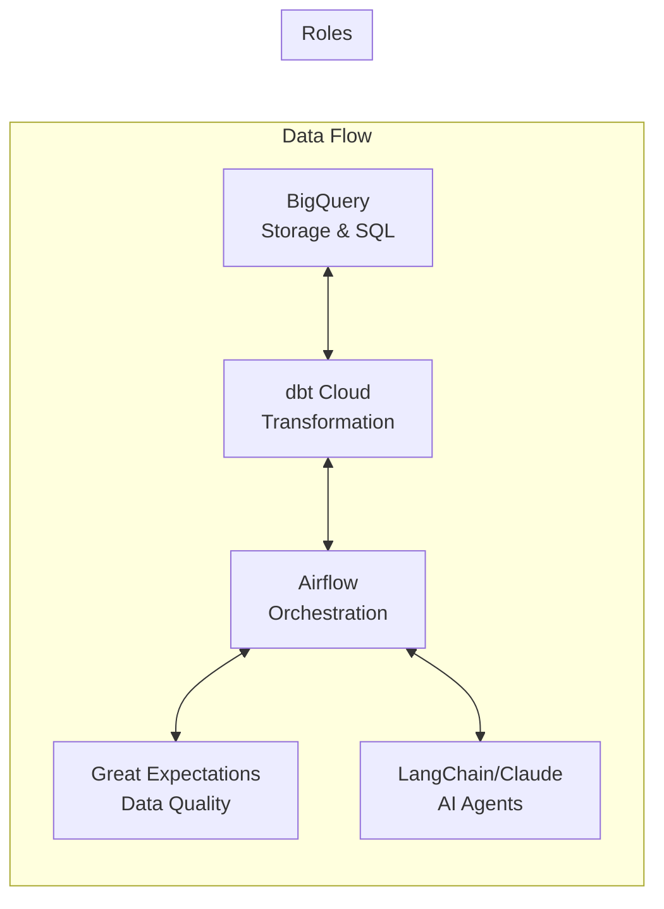

### Phase Progression

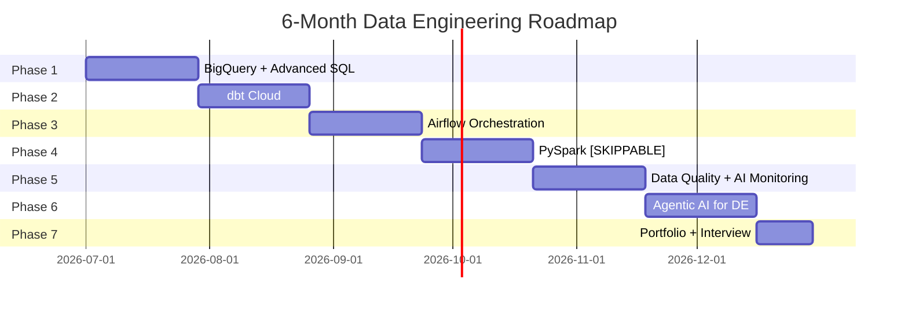

## Phase 1: BigQuery + Advanced SQL

### Weeks 1-4: Advanced SQL for Data Engineering

> **Goal:** Master BigQuery and advanced SQL techniques used in data engineering

### Week 1: BigQuery Setup + Window Functions

#### E-Commerce Database Schema

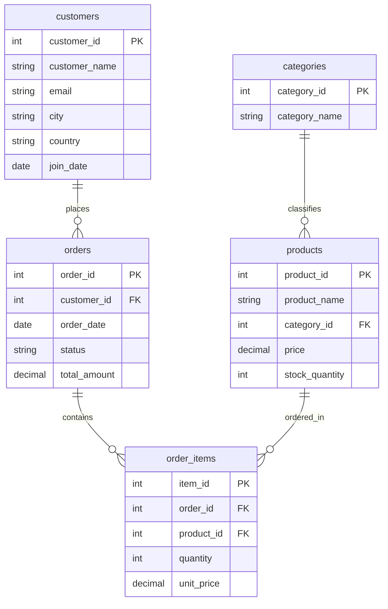

#### Daily Breakdown

| Day | Topic | Exercise | AI Integration |
|-----|-------|----------|----------------|
| 1 | GCP account setup, enable BigQuery, free tier explained | Create first dataset | - |
| 2 | BigQuery Web UI tour, load sample data | Load e-commerce sample dataset | - |
| 3 | SQL Recap: SELECT, WHERE, ORDER BY | Write 10 basic queries | - |
| 4 | SQL Recap: JOINs, GROUP BY, HAVING | Practice joins on sample data | - |
| 5 | Window Functions: ROW_NUMBER, RANK, DENSE_RANK | Ranking exercises | AI explains window functions |
| 6 | Window Functions: LAG, LEAD, FIRST_VALUE, LAST_VALUE | Running totals, YoY comparison | AI generates window function examples |
| 7 | **Quiz** | 10 questions | - |

#### Window Functions Reference

```sql
-- Ranking
SELECT
    product_name,
    price,
    ROW_NUMBER() OVER (ORDER BY price DESC) as row_num,
    RANK() OVER (ORDER BY price DESC) as rank,
    DENSE_RANK() OVER (ORDER BY price DESC) as dense_rank
FROM products;

-- LAG (previous row)
SELECT
    order_date,
    total,
    LAG(total) OVER (ORDER BY order_date) as prev_day_total,
    total - LAG(total) OVER (ORDER BY order_date) as growth
FROM orders;

-- Running total
SELECT
    order_date,
    total,
    SUM(total) OVER (ORDER BY order_date) as running_total
FROM orders;
```

---

### Week 2: Advanced SQL for DE

| Day | Topic | Exercise | AI Integration |
|-----|-------|----------|----------------|
| 1 | Complex CTEs (chaining transformations) | Build 5-layer transformation chain | - |
| 2 | Recursive CTEs (hierarchical data - employees/manager) | Org chart traversal | AI explains recursive patterns |
| 3 | UNION, UNION ALL, INTERSECT, EXCEPT | Set operations practice | - |
| 4 | BigQuery-specific: STRING_AGG, ARRAY_AGG, PIVOT | String aggregation | - |
| 5 | Subqueries vs CTEs vs temp tables performance | Query optimization | AI analyzes query plans |
| 6 | **AI: Text-to-SQL with BigQuery Studio** | Prompt engineering practice | Build 5 natural language queries |
| 7 | **Quiz** | 10 questions | - |

#### CTE Examples

```sql
-- Chained CTEs (5 transformations)
WITH
-- Step 1: Get orders with customer info
orders_with_customers AS (
    SELECT
        o.order_id,
        o.order_date,
        c.customer_name,
        c.city
    FROM orders o
    INNER JOIN customers c ON o.customer_id = c.id
),
-- Step 2: Add order items
orders_with_items AS (
    SELECT
        o.*,
        p.product_name,
        oi.quantity,
        oi.price as item_price
    FROM orders_with_customers o
    INNER JOIN order_items oi ON o.order_id = oi.order_id
    INNER JOIN products p ON oi.product_id = p.id
),
-- Step 3: Calculate line totals
order_lines AS (
    SELECT
        *,
        quantity * item_price as line_total
    FROM orders_with_items
),
-- Step 4: Aggregate by order
order_summary AS (
    SELECT
        order_id,
        order_date,
        customer_name,
        city,
        SUM(line_total) as order_total,
        COUNT(*) as item_count
    FROM order_lines
    GROUP BY order_id, order_date, customer_name, city
)
-- Final: Add ranking
SELECT
    *,
    RANK() OVER (PARTITION BY city ORDER BY order_total DESC) as city_rank
FROM order_summary;
```

---

### Week 3: Data Warehousing

| Day | Topic | Exercise | AI Integration |
|-----|-------|----------|----------------|
| 1 | Star Schema fundamentals (fact vs dimension tables) | Design e-commerce star schema | AI helps design schema |
| 2 | Snowflake Schema, Slowly Changing Dimensions (SCD) | Design SCD Type 2 | - |
| 3 | BigQuery Partitioning & Clustering | Optimize queries with partitioning | AI explains optimization |
| 4 | E-commerce DW design project: orders, customers, products | Create dim_customers, dim_products, fact_orders | - |
| 5 | Building analytics tables (daily revenue, customer LTV) | Build 5 analytics tables | AI assists schema design |
| 6 | **AI: BigQuery Studio for natural language queries** | Text-to-SQL practice | Build 10 natural language queries |
| 7 | **Quiz** | 10 questions | - |

#### Star Schema Example

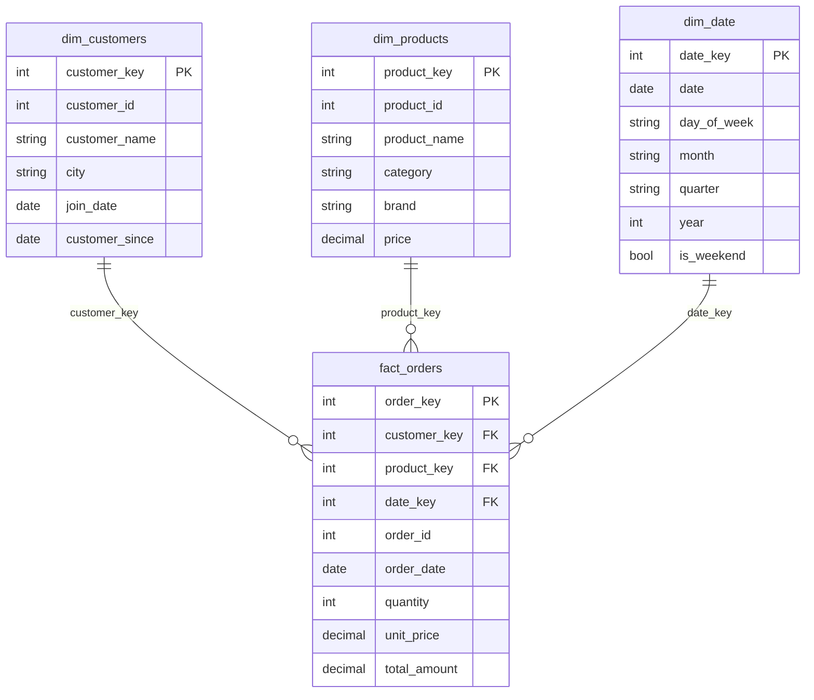

#### Star Schema Visualization

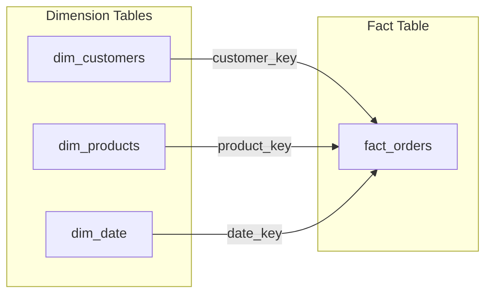

---

### Week 4: Project - E-commerce Analytics Pipeline

| Day | Topic | Deliverable |
|-----|-------|-------------|
| 1 | Design e-commerce DW schema | Star schema diagram |
| 2-3 | Build pipeline: raw → staging → analytics | 3-layer pipeline |
| 4-5 | Create analytics tables: daily_revenue, customer_ltv, product_performance | 5 analytics tables |
| 6 | Document pipeline, add comments | README + lineage |
| 7 | **Quiz** | 10 questions |

#### Deliverables
- [ ] Star schema design document
- [ ] SQL scripts for all tables
- [ ] Documentation with lineage graph
- [ ] 5+ analytics queries

---

## Phase 2: dbt Cloud

### Weeks 5-8: dbt Cloud for Data Transformation

> **Goal:** Build production-ready transformation pipelines with dbt

### Week 5: dbt Fundamentals

| Day | Topic | Exercise | AI Integration |
|-----|-------|----------|----------------|
| 1 | dbt Cloud account setup, connect BigQuery | Create first dbt project | - |
| 2 | dbt project structure, models, folders | Explore dbt anatomy | AI generates base models |
| 3 | Sources, refs, mart models | Build 3-layer structure | - |
| 4 | Schema tests, singular tests | Add tests to models | AI suggests tests |
| 5 | Documentation, lineage graphs | Auto-generate docs | AI auto-generates docs |
| 6 | **AI: dbt Copilot for model generation** | Prompt engineering | Generate 5 models with AI |
| 7 | **Quiz** | 10 questions | - |

#### dbt Project Structure

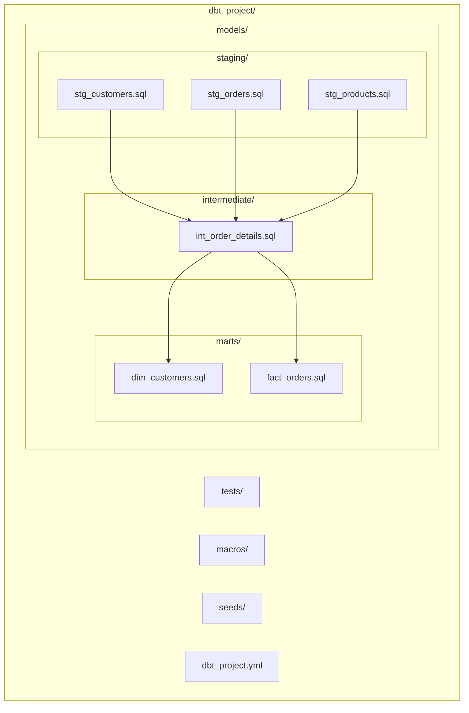

#### Data Flow Through dbt Layers

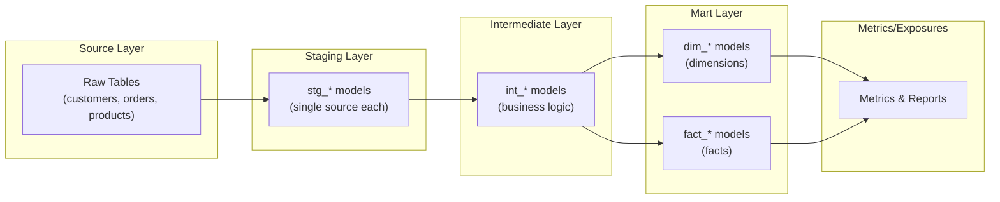

---

### Week 6: dbt Intermediate

| Day | Topic | Exercise | AI Integration |
|-----|-------|----------|----------------|
| 1 | Snapshots, incremental models | Add snapshot + incremental | - |
| 2 | Exposures, metrics, metricflow | Define metrics | - |
| 3 | Hooks, operators, custom materializations | Write custom macro | AI generates macros |
| 4 | Seeds (CSV data for testing) | Add test data | - |
| 5 | Packages (dbt Hub) | Install useful packages | AI recommends packages |
| 6 | **AI: Debugging dbt models with Copilot** | Debug 3 broken models | Debug practice |
| 7 | **Quiz** | 10 questions | - |

---

### Week 7: dbt Advanced

| Day | Topic | Exercise | AI Integration |
|-----|-------|----------|----------------|
| 1 | Macros for reusable code | Build generic macro | AI writes macros |
| 2 | Custom schemas, environments (dev/staging/prod) | Multi-environment setup | - |
| 3 | Advanced tests, generic tests | Build test suite | AI generates test suites |
| 4 | Performance optimization (query timing) | Optimize slow models | AI analyzes performance |
| 5 | dbt Airflow integration | Schedule with Airflow | - |
| 6 | **AI: Generate dbt models from requirements** | End-to-end AI workflow | Build pipeline from text |
| 7 | **Quiz** | 10 questions | - |

---

### Week 8: Project - dbt E-commerce Pipeline

| Day | Topic | Deliverable |
|-----|-------|-------------|
| 1-2 | Build complete dbt pipeline for e-commerce | 10+ models |
| 3-4 | Add data quality tests, documentation | Test coverage >90% |
| 5 | Configure exposures for downstream tools | 5+ exposures |
| 6 | Document + review | README + lineage |
| 7 | **Quiz** | 10 questions |

#### Deliverables
- [ ] dbt project with 10+ models
- [ ] 3-layer structure (staging → intermediate → marts)
- [ ] Test coverage report
- [ ] Documentation with lineage

---

## Phase 3: Airflow Orchestration

### Weeks 9-12: Airflow for Pipeline Orchestration

> **Goal:** Build reliable, scheduled data pipelines

### Week 9: Airflow Fundamentals

| Day | Topic | Exercise | AI Integration |
|-----|-------|----------|----------------|
| 1 | Airflow concepts (DAGs, tasks, operators) | DAG anatomy study | - |
| 2 | Astro CLI setup, first DAG | Create hello_world DAG | AI generates DAG templates |
| 3 | TaskFlow API, XComs | Build task flow | - |
| 4 | Connections, variables | Configure BigQuery connection | AI explains best practices |
| 5 | Sensors (time, file, HTTP) | Build sensor DAG | - |
| 6 | **AI: Generate DAGs with LangChain** | Build 3 simple DAGs | Simple DAG generation |
| 7 | **Quiz** | 10 questions | - |

#### DAG Example

```python
from airflow.decorators import dag, task
from datetime import datetime
import logging

@dag(schedule_interval="0 6 * * *", start_date=datetime(2026, 7, 1))
def daily_ecommerce_pipeline():

    @task
    def extract_orders():
        """Extract orders from BigQuery"""
        from airflow.providers.google.cloud.operators.bigquery import BigQueryInsertJobOperator
        logging.info("Extracting orders...")
        return "extracted_1000_orders"

    @task
    def transform_orders(extracted):
        """Transform orders data"""
        logging.info(f"Transforming: {extracted}")
        return "transformed_500_orders"

    @task
    def load_warehouse(transformed):
        """Load to warehouse"""
        logging.info(f"Loading: {transformed}")
        return "loaded_to_warehouse"

    # Task dependencies
    extract_orders() >> transform_orders() >> load_warehouse()

dag = daily_ecommerce_pipeline()
```

#### DAG Visualization

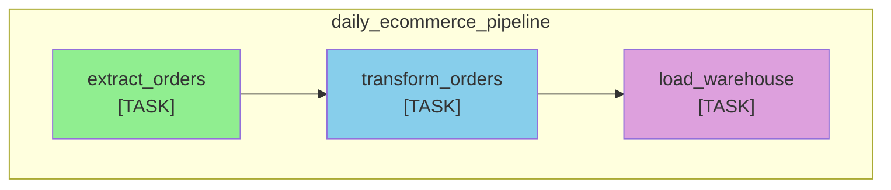

---

### Week 10: Airflow Intermediate

| Day | Topic | Exercise | AI Integration |
|-----|-------|----------|----------------|
| 1 | Branching, task groups | Build branching DAG | AI generates branching logic |
| 2 | SLA monitoring, alerts (email/Slack) | Configure alerts | AI configures alerting |
| 3 | Dynamic DAGs (from config) | Build dynamic DAG | AI helps with templating |
| 4 | SubDAGs, task mapping (parallel processing) | Parallel execution | - |
| 5 | Retry policies, backfills | Handle failures gracefully | AI explains patterns |
| 6 | **AI: Debugging Airflow issues** | Debug 3 broken DAGs | Debug practice |
| 7 | **Quiz** | 10 questions | - |

---

### Week 11: Airflow Advanced

| Day | Topic | Exercise | AI Integration |
|-----|-------|----------|----------------|
| 1 | Airflow + dbt integration | Run dbt from Airflow | - |
| 2 | Airflow + BigQuery operators | Full ELT pipeline | AI generates operators |
| 3 | Custom operators (for reusable logic) | Build custom operator | - |
| 4 | Security best practices (variables, connections) | Secure configuration | AI reviews security |
| 5 | Monitoring with Airflow (stats, metrics) | Build dashboard | AI creates dashboards |
| 6 | **AI: Autonomous pipeline monitoring** | Auto-alert system | Anomaly detection |
| 7 | **Quiz** | 10 questions | - |

---

### Week 12: Project - Full ELT Pipeline

| Day | Topic | Deliverable |
|-----|-------|-------------|
| 1-2 | Build complete ELT pipeline (Airflow → dbt → BigQuery) | 5+ DAGs |
| 3-4 | Add monitoring, alerting, error handling | Slack alerts + dashboards |
| 5 | SLA enforcement, retry logic | Resilient pipeline |
| 6 | Document + review | README + architecture |
| 7 | **Quiz** | 10 questions |

#### Deliverables
- [ ] 5+ production-ready DAGs
- [ ] Error handling + retry logic
- [ ] Monitoring dashboard
- [ ] Slack alerting setup

#### Full ELT Pipeline Architecture

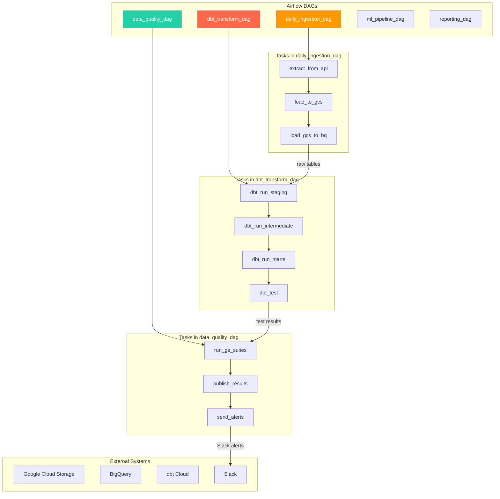

---

## Phase 4: PySpark (Weeks 13-16) [SKIPPABLE]

### Weeks 13-16: PySpark for Big Data Processing

> **Goal:** Process large datasets with distributed computing
> 
> **Note:** This phase is skippable for entry-level DE jobs. Many roles only need SQL + dbt.

#### PySpark in Data Architecture

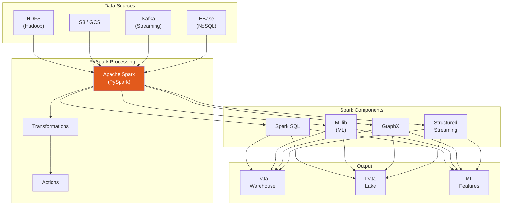

### Week 13: PySpark Fundamentals

| Day | Topic | Exercise | AI Integration |
|-----|-------|----------|----------------|
| 1 | PySpark setup (pip install), SparkSession | First PySpark script | - |
| 2 | DataFrames, schema inference | Create DataFrames | AI explains concepts |
| 3 | Transformations vs Actions | Transformation practice | - |
| 4 | SQL in PySpark | Run SQL queries | AI generates SQL |
| 5 | Window Functions in Spark | Spark window functions | AI explains patterns |
| 6 | **AI: Copilot for PySpark** | Code generation | Generate 5 PySpark scripts |
| 7 | **Quiz** | 10 questions | - |

---

### Week 14: PySpark Intermediate

| Day | Topic | Exercise | AI Integration |
|-----|-------|----------|----------------|
| 1 | Joins optimization (broadcast vs shuffle) | Optimize joins | AI analyzes joins |
| 2 | Aggregations, groupBy, rollup, cube | Advanced aggregation | - |
| 3 | Handling missing data (drop, fill, interpolate) | Data cleaning | AI suggests solutions |
| 4 | Date/time operations | Date transformations | - |
| 5 | Caching, persistence (MEMORY_ONLY, DISK) | Performance optimization | AI recommends strategy |
| 6 | **AI: Optimize PySpark queries** | Performance tuning | Auto-optimization |
| 7 | **Quiz** | 10 questions | - |

---

### Week 15: PySpark Advanced

| Day | Topic | Exercise | AI Integration |
|-----|-------|----------|----------------|
| 1 | Catalyst optimizer, Tungsten engine | Explain plan analysis | AI explains internals |
| 2 | Shuffle optimization, partition tuning | Partition optimization | AI analyzes plans |
| 3 | Structured Streaming basics | Real-time streaming | - |
| 4 | Performance tuning (memory, cores, parallelism) | Tune cluster | AI generates recommendations |
| 5 | PySpark + BigQuery connector | Read/write BigQuery | - |
| 6 | **AI: Autonomous Spark optimization** | Auto-tuning script | Self-optimizing pipeline |
| 7 | **Quiz** | 10 questions | - |

---

### Week 16: Project - PySpark Processing

| Day | Topic | Deliverable |
|-----|-------|-------------|
| 1-2 | Build PySpark pipeline for e-commerce | ETL pipeline |
| 3-4 | Optimize performance | Report with benchmarks |
| 5 | Add monitoring | Logging + metrics |
| 6 | Document + review | README |
| 7 | **Quiz** | 10 questions |

---

## Phase 5: Data Quality + AI Monitoring

### Weeks 17-20: Data Quality Framework

> **Goal:** Ensure data reliability with automated validation

### Week 17: Great Expectations

| Day | Topic | Exercise | AI Integration |
|-----|-------|----------|----------------|
| 1 | Great Expectations setup, concepts | First expectation suite | - |
| 2 | Creating expectation suites | Build 5 suites | AI generates expectations |
| 3 | Validating data, results interpretation | Validate pipeline | - |
| 4 | Great Expectations with BigQuery | GE + BigQuery | - |
| 5 | Great Expectations with dbt (dbt tests) | GE + dbt integration | AI integrates GE + dbt |
| 6 | **AI: Generate expectations from data** | Auto-expectation creation | Analyze data → expectations |
| 7 | **Quiz** | 10 questions | - |

#### Great Expectations Example

```python
import great_expectations as ge

# Load data
df = ge.from_pandas(df)

# Create expectation suite
suite = df.get_expectation_suite("my_suite")

# Add expectations
df.expect_column_values_to_not_be_null("customer_id")
df.expect_column_values_to_be_between("order_total", min_value=0, max_value=10000)
df.expect_column_distinct_values_to_be_in_set("status", ["pending", "completed", "shipped"])

# Validate
results = df.validate()
print(results.success)
```

#### Great Expectations + dbt + Airflow Integration

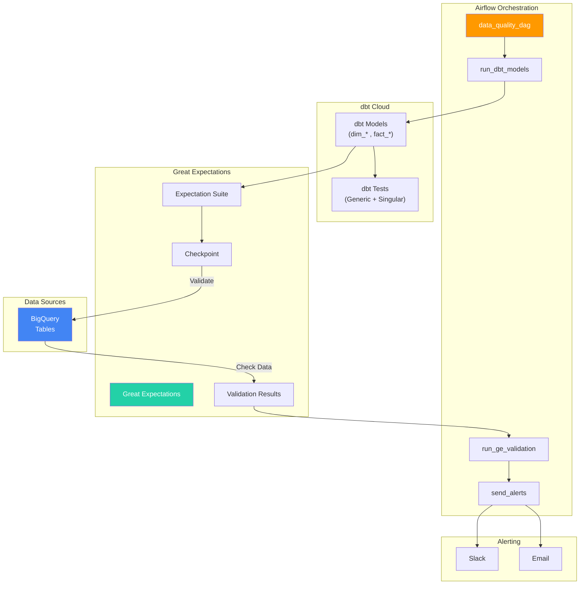

---

### Week 18: Data Quality Intermediate

| Day | Topic | Exercise | AI Integration |
|-----|-------|----------|----------------|
| 1 | Advanced expectations (regex, custom) | Complex validations | AI writes complex expectations |
| 2 | Custom expectation development | Build custom expectation | - |
| 3 | Data profiling with GE | Profile before validating | AI analyzes data quality |
| 4 | Alerting with GE (email, Slack) | Configure notifications | AI configures alerts |
| 5 | Great Expectations + Airflow | Schedule DQ checks | - |
| 6 | **AI: Anomaly detection in data** | ML-based QC | Detect unusual patterns |
| 7 | **Quiz** | 10 questions | - |

---

### Week 19: AI Monitoring

| Day | Topic | Exercise | AI Integration |
|-----|-------|----------|----------------|
| 1 | ML-based data quality monitoring | Set up anomaly detection | AI anomaly detection |
| 2 | Automated alerting pipelines | Build alert pipeline | AI configures auto-alerts |
| 3 | Data lineage tracking (with AI) | Auto-generate lineage | AI traces data flow |
| 4 | Data contract management | Define data contracts | AI enforces contracts |
| 5 | Dashboard creation for DQ | Build monitoring dashboard | AI builds dashboards |
| 6 | **AI: Real-time data quality** | Live monitoring system | Autonomous monitoring |
| 7 | **Quiz** | 10 questions | - |

---

### Week 20: Project - Data Quality Framework

| Day | Topic | Deliverable |
|-----|-------|-------------|
| 1-2 | Build complete DQ framework | GE suites + dashboards |
| 3-4 | Integrate with existing pipelines | DQ in Airflow + dbt |
| 5 | Automated alerting | Slack + email alerts |
| 6 | Document + review | DQ documentation |
| 7 | **Quiz** | 10 questions |

---

## Phase 6: Agentic AI for DE

### Weeks 21-24: Autonomous AI Agents

> **Goal:** Build self-managing data pipelines with AI

### Week 21: AI Pipeline Builders

| Day | Topic | Exercise | AI Integration |
|-----|-------|----------|----------------|
| 1 | LangChain fundamentals | First LangChain app | - |
| 2 | Building autonomous ELT agents | Build simple agent | AI builds agents |
| 3 | Multi-agent systems (planner + executor) | Multi-agent setup | AI coordinates agents |
| 4 | Error handling in AI pipelines | Graceful failure handling | AI handles errors |
| 5 | Human-in-the-loop patterns | Human oversight design | AI + human workflow |
| 6 | **AI: Generate pipelines from requirements** | Text-to-pipeline | Build pipeline from description |
| 7 | **Quiz** | 10 questions | - |

#### AI Agent Example

```python
from langchain.agents import Agent
from langchain.tools import Tool
from langchain.prompts import PromptTemplate

# Define tools
def query_bigquery(sql: str) -> str:
    """Execute SQL on BigQuery"""
    return "query results"

def run_dbt_model(model_name: str) -> str:
    """Run dbt model"""
    return "model results"

# Build agent
tools = [
    Tool(name="query_bigquery", func=query_bigquery),
    Tool(name="run_dbt_model", func=run_dbt_model),
]

agent = Agent(
    prompt=PromptTemplate.from_template(
        "You are a data engineer. {input}\n\n{agent_scratchpad}"
    ),
    tools=tools,
)

# Agent autonomously builds and runs pipeline
result = agent.run("Build a daily revenue report by customer city")
```

#### AI Agent Architecture

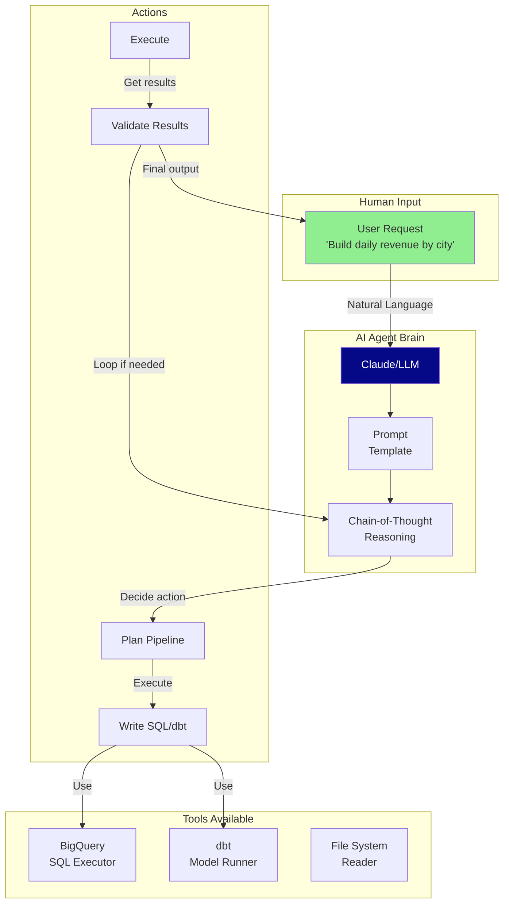

#### Multi-Agent System

```mermaid
flowchart LR
    subgraph "Planner Agent"
        P["Planner\nUnderstands requirements"]
    end

    subgraph "Executor Agent"
        E["Executor\nWrites & runs code"]
    end

    subgraph "Reviewer Agent"
        R["Reviewer\nValidates output"]
    end

    subgraph "Tools"
        SQL["BigQuery"]
        DBT["dbt"]
        AIRFLOW["Airflow"]
    end

    P -->|"Pipeline Plan"| E
    E -->|"Code Results"| R
    R -->|"Approved?"|
    R -->|"Yes: Done"| SUCCESS[("Output")]
    R -->|"No: Fix"| E

    E -->|"Query"| SQL
    E -->|"Run Model"| DBT
    E -->|"Trigger DAG"| AIRFLOW
```

---

### Week 22: AI Pipeline Builders Advanced

| Day | Topic | Exercise | AI Integration |
|-----|-------|----------|----------------|
| 1 | Prompt engineering for DE | Advanced prompts | Advanced prompting |
| 2 | Chain-of-thought debugging | Debug with AI reasoning | AI debugging |
| 3 | Self-correcting pipelines | AI fixes own errors | AI self-healing |
| 4 | A/B testing AI pipelines | AI experimentation | AI experiments |
| 5 | Evaluation frameworks for AI | Measure AI quality | AI evaluates AI |
| 6 | **AI: Production-ready AI pipelines** | Full AI pipeline | End-to-end AI DE |
| 7 | **Quiz** | 10 questions | - |

---

### Week 23: AI Data Catalog

| Day | Topic | Exercise | AI Integration |
|-----|-------|----------|----------------|
| 1 | Data catalog fundamentals | Understand catalog concepts | - |
| 2 | Metadata tagging with AI | Auto-tag tables | AI auto-tags |
| 3 | Data lineage with AI | Trace lineage automatically | AI traces lineage |
| 4 | Search & discovery AI | Semantic search | AI semantic search |
| 5 | Access control AI | Permission management | AI manages permissions |
| 6 | **AI: Autonomous data management** | Self-managing catalog | Auto-cataloging |
| 7 | **Quiz** | 10 questions | - |

#### AI Data Lineage Graph

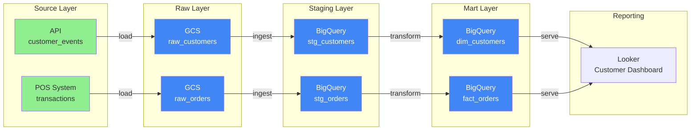

---

### Week 24: Project - AI-Powered Data Platform

| Day | Topic | Deliverable |
|-----|-------|-------------|
| 1-2 | Build AI-powered data platform | Full platform |
| 3-4 | Integrate all AI components | Agent + catalog + monitoring |
| 5 | Document + review | Documentation |
| 7 | **Quiz** | 10 questions |

---

## Phase 7: Portfolio + Interview

### Weeks 25-26: Job Search Preparation

### Week 25: End-to-End Project

| Day | Topic | Deliverable |
|-----|-------|-------------|
| 1-3 | Build complete e-commerce analytics platform | Full pipeline |
| 4-5 | All tools integrated (BigQuery + dbt + Airflow + DQ) | Working platform |
| 6 | Performance optimization | Optimization report |
| 7 | Final documentation | README + architecture |

---

### Week 26: Portfolio + Interview Prep

| Day | Topic | Deliverable |
|-----|-------|-------------|
| 1-2 | Resume building, GitHub setup | Professional resume |
| 3-4 | Mock interviews (SQL + DE concepts) | 5 mock interviews |
| 5-6 | Interview prep: System Design, Behaviorals | Preparation notes |
| 7 | Final review + next steps | Career plan |

---

## Resources & References

### Documentation

| Resource | URL |
|----------|-----|
| BigQuery Docs | cloud.google.com/bigquery/docs |
| dbt Docs | docs.getdbt.com |
| Airflow Docs | airflow.apache.org/docs |
| PySpark Docs | spark.apache.org/docs/latest/api/python |
| Great Expectations | docs.greatexpectations.io |
| LangChain | python.langchain.com/docs |
| Claude API | docs.anthropic.com/claude/reference |

### Free Learning Platforms

| Platform | Focus |
|----------|-------|
| dbt Learn | dbt fundamentals (free) |
| Data Engineering with GCP | Google Cloud skills |
| Kaggle | PySpark, data engineering |

### Practice Platforms

| Platform | Use Case |
|----------|----------|
| BigQuery Sandbox | Free practice |
| dbt Cloud Free Tier | dbt development |
| Astro CLI | Airflow locally |

---

## Progress Tracking

### Phase 1: BigQuery + Advanced SQL
- [ ] Week 1 Quiz
- [ ] Week 2 Quiz
- [ ] Week 3 Quiz
- [ ] Week 4 Project + Quiz

### Phase 2: dbt Cloud
- [ ] Week 5 Quiz
- [ ] Week 6 Quiz
- [ ] Week 7 Quiz
- [ ] Week 8 Project + Quiz

### Phase 3: Airflow
- [ ] Week 9 Quiz
- [ ] Week 10 Quiz
- [ ] Week 11 Quiz
- [ ] Week 12 Project + Quiz

### Phase 4: PySpark [SKIPPABLE]
- [ ] Week 13 Quiz
- [ ] Week 14 Quiz
- [ ] Week 15 Quiz
- [ ] Week 16 Project + Quiz

### Phase 5: Data Quality + AI
- [ ] Week 17 Quiz
- [ ] Week 18 Quiz
- [ ] Week 19 Quiz
- [ ] Week 20 Project + Quiz

### Phase 6: Agentic AI
- [ ] Week 21 Quiz
- [ ] Week 22 Quiz
- [ ] Week 23 Quiz
- [ ] Week 24 Project + Quiz

### Phase 7: Portfolio
- [ ] Complete End-to-End Project
- [ ] Resume
- [ ] GitHub Portfolio
- [ ] Mock Interviews

---

## Agentic AI Implementation Map

| Week | AI Skill | Tool | Feasibility |
|------|----------|------|-------------|
| 2 | Text-to-SQL | BigQuery Studio | ✅ Production-ready |
| 5-7 | dbt Copilot | dbt + LLM | ✅ Production-ready |
| 6 | Debugging | Copilot | ✅ Production-ready |
| 9 | DAG Generation | LangChain + Claude | ⚠️ Good for simple DAGs |
| 11 | Pipeline Monitoring | AI anomaly detection | ⚠️ Good for alerts |
| 17-20 | Data Quality | Great Expectations + LLM | ⚠️ Good for expectations |
| 21-24 | Autonomous Agents | LangChain + Claude | ⚠️ Needs human oversight |

---

## Budget Summary

| Component | Cost |
|-----------|------|
| BigQuery | $0 (free tier) |
| dbt Cloud | $0 (free tier) |
| Airflow (Astro CLI) | $0 |
| Docker | $0 |
| LLM for AI agents | $0 (Claude/Gemini free tier) |
| **Total** | **$0** |

---

## Tips for Success

1. **Practice Daily** - 6-8 hours = focus on depth, not just watching
2. **Build Real Pipelines** - Don't skip projects, they're your portfolio
3. **Use AI Wisely** - AI generates, you verify and understand
4. **Join Communities** - dbt Community, Airflow Slack, Data Engineering Reddit
5. **Review Weekly** - Recap what you learned, identify gaps
6. **Focus on Fundamentals** - SQL + dbt + Airflow = most entry-level jobs
7. **Skip PySpark if needed** - Not all DE jobs require it

---

*Last Updated: July 2026*
*Created for: SQL-DUMMY Learning Path*
*Version: 1.0*
