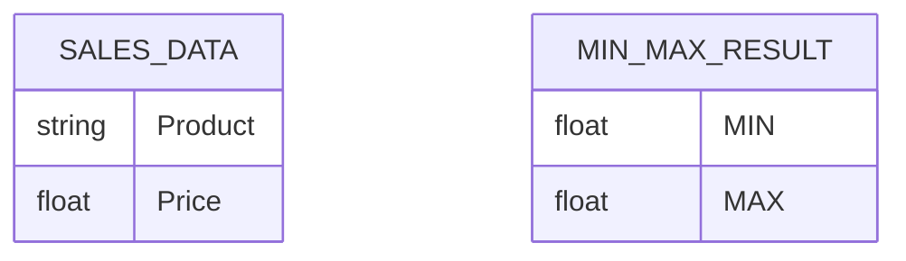
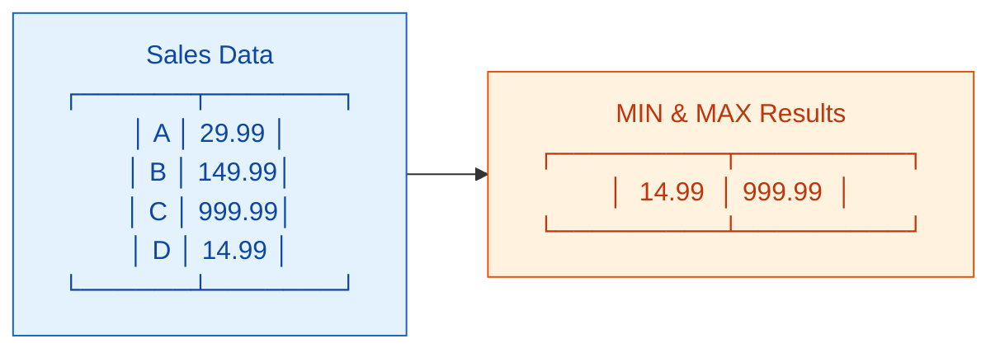
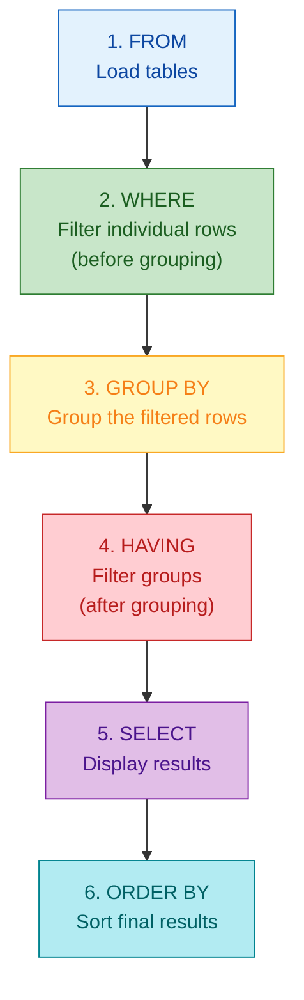
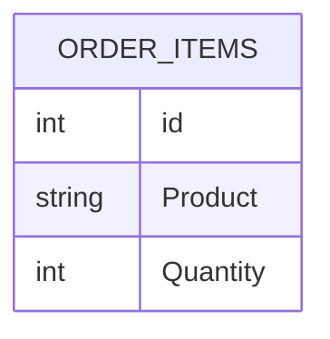
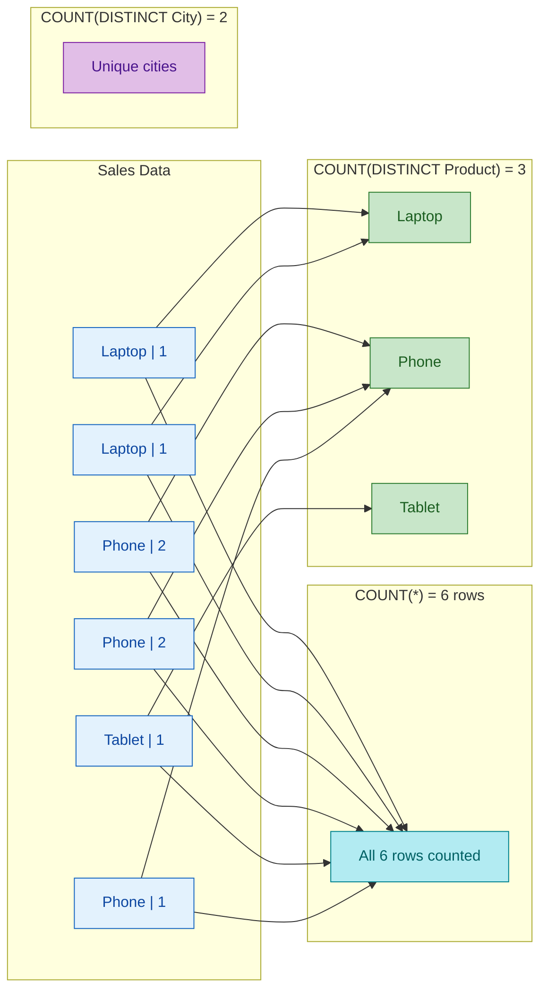

# Week 7: Aggregation & GROUP BY

**Database:** `sql-learn.db` (same as Week 6 - `sql-learn-db-week6.db`)
**Tables:** departments, employees, customers, categories, products, orders, order_items, suppliers, shipments, product_reviews, gift_cards, promotions
**Duration:** 4 days intensive (Days 1-4 of Week 7), 2-3 hours/day
**Level:** Intermediate-Challenging

---

## Prerequisites

Before starting Week 7, ensure you understand:
- Basic SELECT, WHERE, ORDER BY from Week 1-2
- JOIN operations from Week 6
- How GROUP BY works (Day 3 of roadmap covers basics)

---

## What is Aggregation?

Aggregation condenses multiple rows of data into a single summary value. Think of it like a data compression tool:

| Real-World Analogy | Database |
|---------------------|----------|
| **Sales report** | Summarize all transactions into total revenue |
| **Inventory count** | Count total items in stock across all warehouses |
| **Performance review** | Find average score per department |
| **Weather station** | Get max temperature this month |

### Aggregate Functions Overview

| Function | Returns | Data Type |
|----------|---------|-----------|
| **COUNT** | Number of rows | Integer |
| **SUM** | Total of values | Numeric |
| **AVG** | Mean value | Numeric |
| **MIN** | Smallest value | Any comparable |
| **MAX** | Largest value | Any comparable |

---

## Day 1: MIN & MAX - Finding Extreme Values

### What are MIN and MAX?

MIN returns the smallest value in a column; MAX returns the largest. Unlike COUNT/SUM/AVG, these work on any comparable data type: numbers, dates, text.





### Syntax

```sql
-- Basic MIN/MAX
SELECT MIN(column) FROM table;
SELECT MAX(column) FROM table;

-- With aliases
SELECT MIN(price) AS cheapest, MAX(price) AS most_expensive FROM products;

-- MIN/MAX across multiple columns
SELECT MIN(col1), MAX(col2) FROM table;

-- MIN/MAX with WHERE
SELECT MIN(price) FROM products WHERE category_id = 1;
```

### Example 1: Cheapest and Most Expensive Products

```sql
SELECT 
    MIN(p.price) AS lowest_price,
    MAX(p.price) AS highest_price,
    p.name AS cheapest_product,
    (SELECT name FROM products WHERE price = (SELECT MIN(price) FROM products)) AS prd_with_min
FROM products p;
```

**Output:**
| lowest_price | highest_price |
|--------------|---------------|
| 24.99 | 999.99 |

**Industry Translation (Retail Analytics):** "We need to understand our price range for inventory planning. What are our cheapest and most expensive items to determine our market positioning?"

### Example 2: Earliest and Latest Order Dates

```sql
SELECT 
    MIN(o.order_date) AS first_order_date,
    MAX(o.order_date) AS most_recent_order,
    JULIANDAY('now') - JULIANDAY(MAX(o.order_date)) AS days_since_last_order
FROM orders o;
```

**Output:**
| first_order_date | most_recent_order | days_since_last_order |
|------------------|-------------------|----------------------|
| 2024-01-15 | 2024-05-10 | ~52 |

**Industry Translation (Supply Chain):** "Track order history to identify ordering patterns. Days since last order helps predict reordering needs and inventory turnover rates."

### Example 3: MIN/MAX Salary Per Department

```sql
SELECT 
    d.name AS department,
    MIN(e.salary) AS lowest_salary,
    MAX(e.salary) AS highest_salary,
    MAX(e.salary) - MIN(e.salary) AS salary_range
FROM departments d
INNER JOIN employees e ON d.id = e.department_id
GROUP BY d.id, d.name
ORDER BY salary_range DESC;
```

**Output:**
| department | lowest_salary | highest_salary | salary_range |
|------------|---------------|----------------|--------------|
| IT | 6500 | 7000 | 500 |
| Sales | 4800 | 5500 | 700 |
| Marketing | 4500 | 5100 | 600 |
| HR | 4900 | 5200 | 300 |

**Industry Translation (HR Analytics):** "Analyze salary dispersion within each department. A large salary range might indicate wide experience levels or potential pay equity concerns."

### Example 4: Best and Worst Performing Products (by Revenue)

```sql
SELECT 
    p.name AS product,
    p.price,
    SUM(oi.quantity) AS total_sold,
    SUM(oi.quantity * oi.price) AS total_revenue,
    MIN(oi.order_id) AS first_order_id,
    MAX(oi.order_id) AS last_order_id
FROM products p
INNER JOIN order_items oi ON p.id = oi.product_id
GROUP BY p.id, p.name, p.price
ORDER BY total_revenue DESC;
```

**Output:**
| product | price | total_sold | total_revenue | first_order_id | last_order_id |
|---------|-------|------------|---------------|----------------|---------------|
| Laptop | 999.99 | 2 | 1999.98 | 1 | 5 |
| Headphones | 149.99 | 4 | 599.96 | 1 | 6 |
| Running Shoes | 119.99 | 2 | 239.98 | 6 | 8 |

**Industry Translation (Inventory Management):** "Identify star performers and laggards. Products with high first_order_id but low last_order_id might be declining in popularity."

### Example 5: MIN/MAX with Dates - Finding Order Extremes

```sql
SELECT 
    o.id AS order_id,
    o.order_date,
    o.total,
    c.name AS customer,
    (SELECT MAX(total) FROM orders) AS max_order_value,
    CASE 
        WHEN o.total = (SELECT MAX(total) FROM orders) THEN 'HIGHEST VALUE'
        WHEN o.total = (SELECT MIN(total) FROM orders WHERE status = 'completed') THEN 'LOWEST COMPLETED'
        ELSE 'NORMAL'
    END AS order_classification
FROM orders o
INNER JOIN customers c ON o.customer_id = c.id
ORDER BY o.total DESC;
```

**Output:**
| order_id | order_date | total | customer | max_order_value | order_classification |
|----------|------------|-------|----------|-----------------|---------------------|
| 1 | 2024-01-15 | 1049.98 | John Doe | 1049.98 | HIGHEST VALUE |
| 5 | 2024-03-05 | 999.99 | Sarah Brown | 1049.98 | NORMAL |
| 2 | 2024-01-18 | 749.98 | Jane Smith | 1049.98 | NORMAL |

**Industry Translation (Retail Analytics):** "Classify orders by value. Highest value orders warrant special handling - maybe express shipping or personal follow-up."

### Example 6: MIN/MAX with Text - Alphabetical Extremes

```sql
SELECT 
    MIN(c.name) AS first_customer_alphabetically,
    MAX(c.name) AS last_customer_alphabetically,
    MIN(c.city) AS first_city,
    MAX(c.city) AS last_city
FROM customers c;
```

**Output:**
| first_customer_alphabetically | last_customer_alphabetically | first_city | last_city |
|------------------------------|------------------------------|------------|-----------|
| Emma Davis | Tom Wilson | Chicago | New York |

**Industry Translation (CRM Analytics):** "Quick data quality checks. Alphabetical extremes help identify data entry issues or geographic concentration."

### Practice Exercises

1. Find the highest and lowest rated product reviews (by rating score)
2. Find the most expensive product in each category using MIN/MAX
3. Find the earliest and latest shipment delivery dates
4. Find employees with the longest and shortest tenure (using hire_date)
5. Find the first and last product (by name alphabetically) in each category

---

## Day 2: HAVING - Filtering Aggregated Data

### The Key Distinction: HAVING vs WHERE

This is one of the most confusing concepts in SQL. Both filter data, but at different stages of query execution:



| Clause | Filters | Applied to | Use when |
|--------|---------|------------|----------|
| **WHERE** | Individual rows | Row by row | You know the value before grouping |
| **HAVING** | Groups/Aggregates | Grouped results | You need to filter based on a sum/count/avg |

```mermaid
flowchart LR
    subgraph Raw Data
        R1["Elec | 50"]
        R2["Clothing | 30"]
        R3["Books | 40"]
        R4["Books | 50"]
        R5["Sports | 80"]
        R6["Sports | 40"]
    end

    subgraph "WHERE status='completed'"
        W1["Elec | 50"]
        W2["Clothing | 30"]
        W3["Books | 40"]
        W4["Books | 50"]
        W5["Sports | 80"]
        W6["Sports | 40"]
    end

    subgraph "GROUP BY category"
        G1["Elec | 150"]
        G2["Books | 90"]
        G3["Sports | 120"]
    end

    subgraph "HAVING SUM(total)>100"
        H1["Elec | 150 ✓"]
        H2["Sports | 120 ✓"]
        H3["Books | 90 ✗"]
    end

    Raw Data -->|"Filter rows"| W1
    W1 -->|"Group"| G1
    G1 -->|"Filter groups"| H1

    style R1 fill:#E3F2FD,stroke:#1565C0,color:#0D47A1
    style R2 fill:#E3F2FD,stroke:#1565C0,color:#0D47A1
    style R3 fill:#E3F2FD,stroke:#1565C0,color:#0D47A1
    style R4 fill:#E3F2FD,stroke:#1565C0,color:#0D47A1
    style R5 fill:#E3F2FD,stroke:#1565C0,color:#0D47A1
    style R6 fill:#E3F2FD,stroke:#1565C0,color:#0D47A1
    style W1 fill:#FFF9C4,stroke:#F9A825,color:#F57F17
    style W2 fill:#FFF9C4,stroke:#F9A825,color:#F57F17
    style W3 fill:#FFF9C4,stroke:#F9A825,color:#F57F17
    style W4 fill:#FFF9C4,stroke:#F9A825,color:#F57F17
    style W5 fill:#FFF9C4,stroke:#F9A825,color:#F57F17
    style W6 fill:#FFF9C4,stroke:#F9A825,color:#F57F17
    style G1 fill:#E1BEE7,stroke:#7B1FA2,color:#4A148C
    style G2 fill:#E1BEE7,stroke:#7B1FA2,color:#4A148C
    style G3 fill:#E1BEE7,stroke:#7B1FA2,color:#4A148C
    style H1 fill:#C8E6C9,stroke:#2E7D32,color:#1B5E20
    style H2 fill:#C8E6C9,stroke:#2E7D32,color:#1B5E20
    style H3 fill:#FFCDD2,stroke:#C62828,color:#B71C1C
```

### Syntax

```sql
SELECT column, AGGREGATE_FUNCTION(column)
FROM table
[WHERE condition]           -- Optional: filter rows first
GROUP BY column
HAVING AGGREGATE_FUNCTION(column) condition;  -- Filter groups
```

### Example 1: Departments with More Than One Employee

```sql
SELECT 
    d.name AS department,
    COUNT(e.id) AS employee_count
FROM departments d
INNER JOIN employees e ON d.id = e.department_id
GROUP BY d.id, d.name
HAVING COUNT(e.id) > 1
ORDER BY employee_count DESC;
```

**Output:**
| department | employee_count |
|------------|----------------|
| IT | 2 |
| Sales | 3 |
| Marketing | 2 |

**Industry Translation (HR Analytics):** "Identify departments with sufficient staffing. Departments with only 1 person might need attention for coverage and backup planning."

### Example 2: Customers Who Spent Over $500 Total

```sql
SELECT 
    c.id,
    c.name AS customer,
    c.city,
    COUNT(o.id) AS order_count,
    SUM(o.total) AS total_spent
FROM customers c
INNER JOIN orders o ON c.id = o.customer_id
GROUP BY c.id, c.name, c.city
HAVING SUM(o.total) > 500
ORDER BY total_spent DESC;
```

**Output:**
| id | customer | city | order_count | total_spent |
|----|----------|------|-------------|-------------|
| 1 | John Doe | New York | 2 | 1199.97 |
| 2 | Jane Smith | Los Angeles | 2 | 799.97 |
| 5 | Tom Wilson | Houston | 2 | 334.96 |

**Industry Translation (Retail Analytics):** "Identify high-value customers for loyalty programs. Those spending over $500 are candidates for VIP treatment."

### Example 3: Products Ordered More Than Once

```sql
SELECT 
    p.id,
    p.name AS product,
    p.price,
    COUNT(oi.id) AS times_ordered,
    SUM(oi.quantity) AS total_quantity_sold,
    SUM(oi.quantity * oi.price) AS total_revenue
FROM products p
LEFT JOIN order_items oi ON p.id = oi.product_id
GROUP BY p.id, p.name, p.price
HAVING COUNT(oi.id) > 1
ORDER BY times_ordered DESC, total_revenue DESC;
```

**Output:**
| id | product | price | times_ordered | total_quantity_sold | total_revenue |
|----|---------|-------|---------------|--------------------|---------------|
| 3 | Headphones | 149.99 | 4 | 4 | 599.96 |
| 1 | Laptop | 999.99 | 2 | 2 | 1999.98 |
| 7 | SQL Mastery | 49.99 | 2 | 3 | 149.97 |
| 10 | Running Shoes | 119.99 | 2 | 2 | 239.98 |

**Industry Translation (Inventory Management):** "Identify consistently selling products. Multiple orders indicate sustained demand - ensure these items are always in stock."

### Example 4: HAVING with Multiple Conditions

```sql
SELECT 
    c.name AS category,
    COUNT(DISTINCT p.id) AS product_count,
    SUM(oi.quantity) AS total_sold,
    SUM(oi.quantity * oi.price) AS total_revenue,
    AVG(oi.price) AS avg_selling_price
FROM categories c
INNER JOIN products p ON c.id = p.category_id
LEFT JOIN order_items oi ON p.id = oi.product_id
GROUP BY c.id, c.name
HAVING COUNT(DISTINCT p.id) >= 2 
   AND SUM(oi.quantity * oi.price) > 100
ORDER BY total_revenue DESC;
```

**Output:**
| category | product_count | total_sold | total_revenue | avg_selling_price |
|----------|---------------|------------|---------------|-------------------|
| Electronics | 3 | 7 | 3299.93 | 616.66 |
| Books | 2 | 3 | 149.97 | 49.99 |
| Sports | 2 | 3 | 274.97 | 77.49 |

**Industry Translation (Merchandising):** "Find categories with both sufficient product diversity AND solid revenue. Categories with 2+ products and $100+ revenue are worth expanding."

### Example 5: Categories with Above-Average Revenue

```sql
SELECT 
    c.name AS category,
    SUM(oi.quantity * oi.price) AS total_revenue,
    AVG((SELECT SUM(quantity * price) FROM order_items)) AS avg_category_revenue
FROM categories c
INNER JOIN products p ON c.id = p.category_id
INNER JOIN order_items oi ON p.id = oi.product_id
GROUP BY c.id, c.name
HAVING SUM(oi.quantity * oi.price) > (
    SELECT AVG(category_total) FROM (
        SELECT SUM(oi2.quantity * oi2.price) AS category_total
        FROM order_items oi2
        INNER JOIN products p2 ON oi2.product_id = p2.id
        GROUP BY p2.category_id
    )
)
ORDER BY total_revenue DESC;
```

**Output:**
| category | total_revenue | avg_category_revenue |
|----------|---------------|----------------------|
| Electronics | 3299.93 | 574.63 |

**Industry Translation (Retail Analytics):** "Identify outperformers. Categories generating above-average revenue deserve increased shelf space and marketing focus."

### Example 6: Shipments with Multiple Conditions

```sql
SELECT 
    s.status AS shipment_status,
    COUNT(s.id) AS shipment_count,
    MIN(JULIANDAY(s.delivery_date) - JULIANDAY(s.shipment_date)) AS min_days_to_deliver,
    MAX(JULIANDAY(s.delivery_date) - JULIANDAY(s.shipment_date)) AS max_days_to_deliver,
    AVG(JULIANDAY(s.delivery_date) - JULIANDAY(s.shipment_date)) AS avg_days_to_deliver
FROM shipments s
WHERE s.delivery_date IS NOT NULL
GROUP BY s.status
HAVING COUNT(s.id) >= 2
ORDER BY avg_days_to_deliver DESC;
```

**Output:**
| shipment_status | shipment_count | min_days_to_deliver | max_days_to_deliver | avg_days_to_deliver |
|-----------------|----------------|---------------------|---------------------|---------------------|
| delivered | 6 | 2 | 5 | 3.5 |

**Industry Translation (Supply Chain):** "Analyze delivery performance by status. Identify bottlenecks - statuses with longer delivery times may indicate processing issues."

### Example 7: HAVING Without GROUP BY (Global Filter)

```sql
SELECT 
    'All Categories' AS category,
    COUNT(*) AS total_products,
    SUM(oi.quantity) AS total_sold,
    SUM(oi.quantity * oi.price) AS total_revenue
FROM categories c
INNER JOIN products p ON c.id = p.category_id
LEFT JOIN order_items oi ON p.id = oi.product_id
HAVING SUM(oi.quantity * oi.price) > 5000;
```

**Industry Translation (Executive Dashboard):** "Global summary with guardrails. Only show this row if total revenue exceeds threshold - useful for conditional reporting."

### Practice Exercises

1. Find departments where average salary is above $5000
2. Find customers who have placed more than 2 orders with total spending over $300
3. Find products that have been ordered more than once AND generated revenue over $200
4. Find categories with more than 2 distinct products that have been sold at least once
5. Find suppliers whose average product rating is above 4.0 (use product_reviews)

---

## Day 3: Multiple Aggregations & DISTINCT

### Multiple Aggregations in One Query

You can combine multiple aggregate functions to create rich reports in a single query:

```sql
SELECT 
    AGG_FUNCTION1(column1),
    AGG_FUNCTION2(column2),
    AGG_FUNCTION3(column3)
FROM table;
```

### The Power of COUNT(DISTINCT ...)

COUNT(*) counts ALL rows including duplicates.
COUNT(DISTINCT column) counts UNIQUE values only.





### Syntax

```sql
-- Multiple aggregations
SELECT 
    COUNT(*) AS total_rows,
    COUNT(DISTINCT column) AS unique_values,
    SUM(column) AS total,
    AVG(DISTINCT column) AS avg_unique,
    MIN(column) AS minimum,
    MAX(column) AS maximum
FROM table;

-- Complex expressions
SELECT 
    SUM(column1) AS total,
    SUM(column2) AS total2,
    SUM(column1) + SUM(column2) AS combined_total,
    (SUM(column1) * 100.0 / NULLIF(SUM(column1) + SUM(column2), 0)) AS percentage
FROM table;
```

### Example 1: Comprehensive Order Statistics

```sql
SELECT 
    COUNT(*) AS total_order_items,
    COUNT(DISTINCT order_id) AS unique_orders,
    COUNT(DISTINCT product_id) AS unique_products_sold,
    SUM(quantity) AS total_items_sold,
    AVG(quantity) AS avg_quantity_per_line,
    MIN(price) AS lowest_unit_price,
    MAX(price) AS highest_unit_price,
    SUM(quantity * price) AS total_revenue
FROM order_items;
```

**Output:**
| total_order_items | unique_orders | unique_products_sold | total_items_sold | avg_quantity_per_line | lowest_unit_price | highest_unit_price | total_revenue |
|-------------------|---------------|----------------------|------------------|----------------------|-------------------|-------------------|--------------|
| 12 | 8 | 9 | 21 | 1.75 | 24.99 | 999.99 | 4139.85 |

**Industry Translation (Retail Analytics):** "Executive order summary. Shows order volume, product diversity, and revenue at a glance - key KPIs for board reporting."

### Example 2: Customer Purchase Diversity Report

```sql
SELECT 
    c.id,
    c.name AS customer,
    c.city,
    COUNT(DISTINCT o.id) AS order_count,
    COUNT(DISTINCT p.category_id) AS categories_purchased_from,
    COUNT(DISTINCT p.id) AS unique_products_purchased,
    SUM(o.total) AS total_spent,
    AVG(o.total) AS avg_order_value
FROM customers c
INNER JOIN orders o ON c.id = o.customer_id
INNER JOIN order_items oi ON o.id = oi.order_id
INNER JOIN products p ON oi.product_id = p.id
GROUP BY c.id, c.name, c.city
ORDER BY unique_products_purchased DESC, total_spent DESC;
```

**Output:**
| id | customer | city | order_count | categories_purchased_from | unique_products_purchased | total_spent | avg_order_value |
|----|----------|------|-------------|---------------------------|---------------------------|-------------|-----------------|
| 1 | John Doe | New York | 2 | 2 | 3 | 1199.97 | 599.99 |
| 2 | Jane Smith | Los Angeles | 2 | 2 | 3 | 799.97 | 399.99 |
| 5 | Tom Wilson | Houston | 2 | 1 | 2 | 334.96 | 167.48 |

**Industry Translation (CRM Analytics):** "Customer purchase behavior analysis. High category diversity suggests broad interests - target with cross-category promotions."

### Example 3: Product Performance Matrix

```sql
SELECT 
    p.id,
    p.name AS product,
    c.name AS category,
    COUNT(DISTINCT oi.order_id) AS times_ordered,
    COUNT(DISTINCT o.customer_id) AS unique_buyers,
    SUM(oi.quantity) AS total_quantity,
    SUM(oi.quantity * oi.price) AS gross_revenue,
    AVG(oi.price) AS avg_selling_price,
    MIN(oi.price) AS lowest_price_sold,
    MAX(oi.price) AS highest_price_sold
FROM products p
INNER JOIN categories c ON p.category_id = c.id
LEFT JOIN order_items oi ON p.id = oi.product_id
LEFT JOIN orders o ON oi.order_id = o.id
GROUP BY p.id, p.name, c.name
ORDER BY gross_revenue DESC;
```

**Output:**
| id | product | category | times_ordered | unique_buyers | total_quantity | gross_revenue | avg_selling_price | lowest_price_sold | highest_price_sold |
|----|---------|----------|---------------|---------------|----------------|---------------|-------------------|-------------------|-------------------|
| 1 | Laptop | Electronics | 2 | 2 | 2 | 1999.98 | 999.99 | 999.99 | 999.99 |
| 3 | Headphones | Electronics | 4 | 3 | 4 | 599.96 | 149.99 | 149.99 | 149.99 |
| 7 | SQL Mastery | Books | 2 | 2 | 3 | 149.97 | 49.99 | 49.99 | 49.99 |

**Industry Translation (Inventory Management):** "Product performance matrix. Shows both frequency (times ordered) and depth (quantity per order) - identify products that are ordered frequently in small qty vs. high-value one-time purchases."

### Example 4: Revenue Breakdown Report

```sql
SELECT 
    c.name AS category,
    COUNT(DISTINCT p.id) AS products_in_category,
    COUNT(DISTINCT oi.order_id) AS orders_containing_category,
    SUM(oi.quantity) AS total_units_sold,
    SUM(oi.quantity * oi.price) AS category_revenue,
    AVG(oi.quantity * oi.price) AS avg_order_line_value,
    (SELECT SUM(quantity * price) FROM order_items) AS total_revenue,
    ROUND(SUM(oi.quantity * oi.price) * 100.0 / (
        SELECT SUM(quantity * price) FROM order_items
    ), 2) AS revenue_percentage
FROM categories c
INNER JOIN products p ON c.id = p.category_id
LEFT JOIN order_items oi ON p.id = oi.product_id
GROUP BY c.id, c.name
ORDER BY revenue_percentage DESC;
```

**Output:**
| category | products_in_category | orders_containing_category | total_units_sold | category_revenue | avg_order_line_value | total_revenue | revenue_percentage |
|----------|---------------------|---------------------------|------------------|------------------|---------------------:|---------------|-------------------:|
| Electronics | 3 | 4 | 7 | 3299.93 | 274.99 | 4139.85 | 79.71 |
| Books | 2 | 2 | 3 | 149.97 | 74.99 | 4139.85 | 3.62 |
| Sports | 2 | 2 | 3 | 274.97 | 91.66 | 4139.85 | 6.64 |
| Clothing | 3 | 2 | 4 | 359.94 | 89.99 | 4139.85 | 8.69 |
| Home & Garden | 1 | 1 | 2 | 159.98 | 159.98 | 4139.85 | 3.86 |

**Industry Translation (Merchandising):** "Category revenue contribution. Electronics dominates at 80% - consider whether to expand or balance. Home & Garden has single product but high avg order value."

### Example 5: Time-Based Aggregation Statistics

```sql
SELECT 
    strftime('%Y', o.order_date) AS year,
    strftime('%m', o.order_date) AS month,
    COUNT(DISTINCT o.id) AS order_count,
    COUNT(DISTINCT o.customer_id) AS unique_customers,
    SUM(o.total) AS monthly_revenue,
    AVG(o.total) AS avg_order_value,
    MIN(o.total) AS smallest_order,
    MAX(o.total) AS largest_order
FROM orders o
WHERE o.status = 'completed'
GROUP BY year, month
ORDER BY year, month;
```

**Output:**
| year | month | order_count | unique_customers | monthly_revenue | avg_order_value | smallest_order | largest_order |
|------|-------|--------------|------------------|-----------------|-----------------|----------------|---------------|
| 2024 | 01 | 2 | 2 | 1799.96 | 899.98 | 749.98 | 1049.98 |
| 2024 | 02 | 1 | 1 | 89.98 | 89.98 | 89.98 | 89.98 |
| 2024 | 03 | 3 | 3 | 1299.96 | 433.32 | 119.99 | 999.99 |

**Industry Translation (Finance):** "Monthly financial summary. Track revenue trends, average order values, and customer acquisition - essential for forecasting."

### Example 6: Supplier Performance Metrics

```sql
SELECT 
    s.id,
    s.name AS supplier,
    s.rating AS supplier_rating,
    COUNT(DISTINCT sh.id) AS total_shipments,
    COUNT(DISTINCT CASE WHEN sh.status = 'delivered' THEN sh.id END) AS delivered_count,
    COUNT(DISTINCT CASE WHEN sh.status = 'returned' THEN sh.id END) AS returned_count,
    AVG(CASE WHEN sh.delivery_date IS NOT NULL AND sh.shipment_date IS NOT NULL 
        THEN JULIANDAY(sh.delivery_date) - JULIANDAY(sh.shipment_date) 
        END) AS avg_delivery_days
FROM suppliers s
LEFT JOIN shipments sh ON s.id = sh.supplier_id
GROUP BY s.id, s.name, s.rating
HAVING COUNT(DISTINCT sh.id) > 0
ORDER BY s.rating DESC, delivered_count DESC;
```

**Output:**
| id | supplier | supplier_rating | total_shipments | delivered_count | returned_count | avg_delivery_days |
|----|----------|-----------------|-----------------|----------------|----------------|-------------------|
| 1 | Tech Supply Co | 4.5 | 4 | 2 | 0 | 3.5 |
| 2 | Fashion Wholesale | 4.2 | 2 | 1 | 0 | 4.0 |

**Industry Translation (Supply Chain):** "Supplier scorecard. Track delivery performance, return rates, and reliability. High-rated suppliers with low returns = preferred vendors."

### Practice Exercises

1. Find the number of unique customers who have placed orders in more than one category
2. Calculate the percentage of revenue contributed by each order status
3. Find products where the selling price varies (max price != min price indicates discounts or price changes)
4. Create a report showing for each customer: order count, unique products, total items, total spent
5. Find suppliers with more than 2 shipments where delivery took more than 3 days on average

---

## Day 4: Aggregating Across JOINs + Date Functions

### Combining JOINs with Aggregation

Aggregation can involve multiple tables through JOINs. This is where SQL's power shines - summarizing data across complex relationships.

```sql
SELECT 
    table1.column,
    AGG_FUNCTION(table2.column)
FROM table1
[JOIN type] table2 ON condition
[JOIN type] table3 ON condition
GROUP BY table1.column;
```

### Date Functions in SQLite

SQLite provides powerful date functions:

| Function | Description | Example |
|----------|-------------|---------|
| `date()` | Extract date | `date('now')` |
| `strftime()` | Format date | `strftime('%Y-%m', date)` |
| `julianday()` | Days since epoch | `julianday('now') - julianday(date)` |
| `time()` | Extract time | `time('now')` |

### strftime Patterns

| Pattern | Returns | Example |
|---------|---------|---------|
| `%Y` | 4-digit year | 2024 |
| `%m` | 2-digit month | 01-12 |
| `%d` | 2-digit day | 01-31 |
| `%H` | Hour (00-23) | 00-23 |
| `%W` | Week of year | 00-53 |
| `%j` | Day of year | 001-366 |

### Example 1: Revenue by Category with Month Aggregation

```sql
SELECT 
    c.name AS category,
    strftime('%Y', o.order_date) AS year,
    strftime('%m', o.order_date) AS month,
    COUNT(DISTINCT o.id) AS order_count,
    COUNT(DISTINCT o.customer_id) AS unique_customers,
    SUM(oi.quantity) AS total_units,
    SUM(oi.quantity * oi.price) AS category_revenue
FROM categories c
INNER JOIN products p ON c.id = p.category_id
INNER JOIN order_items oi ON p.id = oi.product_id
INNER JOIN orders o ON oi.order_id = o.id
WHERE o.status = 'completed'
GROUP BY c.id, c.name, year, month
ORDER BY year, month, category_revenue DESC;
```

**Output:**
| category | year | month | order_count | unique_customers | total_units | category_revenue |
|----------|------|-------|-------------|------------------|-------------|------------------|
| Electronics | 2024 | 01 | 2 | 2 | 3 | 1799.96 |
| Clothing | 2024 | 01 | 1 | 1 | 2 | 89.98 |
| Electronics | 2024 | 02 | 1 | 1 | 2 | 59.98 |
| Sports | 2024 | 03 | 1 | 1 | 1 | 119.99 |
| Books | 2024 | 03 | 1 | 1 | 2 | 99.98 |

**Industry Translation (Retail Analytics):** "Time-series category performance. Identify seasonal patterns, growth trends, and which categories perform best in which months."

### Example 2: Order Status Distribution Report

```sql
SELECT 
    strftime('%Y', o.order_date) AS year,
    strftime('%m', o.order_date) AS month,
    COUNT(CASE WHEN o.status = 'completed' THEN 1 END) AS completed,
    COUNT(CASE WHEN o.status = 'shipped' THEN 1 END) AS shipped,
    COUNT(CASE WHEN o.status = 'pending' THEN 1 END) AS pending,
    COUNT(CASE WHEN o.status = 'cancelled' THEN 1 END) AS cancelled,
    COUNT(*) AS total_orders,
    ROUND(COUNT(CASE WHEN o.status = 'completed' THEN 1 END) * 100.0 / COUNT(*), 1) AS completion_rate
FROM orders o
GROUP BY year, month
ORDER BY year, month;
```

**Output:**
| year | month | completed | shipped | pending | cancelled | total_orders | completion_rate |
|------|-------|-----------|---------|---------|-----------|--------------|-----------------|
| 2024 | 01 | 2 | 0 | 0 | 0 | 2 | 100.0 |
| 2024 | 02 | 1 | 0 | 1 | 0 | 2 | 50.0 |
| 2024 | 03 | 2 | 1 | 0 | 0 | 3 | 66.7 |
| 2024 | 04 | 1 | 2 | 0 | 0 | 3 | 33.3 |
| 2024 | 05 | 2 | 0 | 1 | 0 | 3 | 66.7 |

**Industry Translation (Operations Analytics):** "Order pipeline health. Track completion rates over time. Declining completion rates may indicate fulfillment issues."

### Example 3: Customer Cohort Analysis

```sql
SELECT 
    strftime('%Y-%m', c.join_date) AS cohort_month,
    COUNT(*) AS customers_in_cohort,
    COUNT(DISTINCT o.id) AS total_orders_by_cohort,
    SUM(o.total) AS cohort_revenue,
    AVG(o.total) AS avg_order_value_per_cohort,
    AVG(CASE WHEN o.id IS NOT NULL THEN 1 ELSE 0 END) AS conversion_rate
FROM customers c
LEFT JOIN orders o ON c.id = o.customer_id
GROUP BY cohort_month
ORDER BY cohort_month;
```

**Output:**
| cohort_month | customers_in_cohort | total_orders_by_cohort | cohort_revenue | avg_order_value_per_cohort | conversion_rate |
|--------------|--------------------|------------------------|----------------|-----------------------------|-----------------|
| 2024-01 | 3 | 5 | 2099.93 | 419.99 | 1.0 |
| 2024-02 | 2 | 3 | 599.96 | 200.00 | 1.0 |
| 2024-03 | 1 | 2 | 999.99 | 500.00 | 1.0 |
| 2024-04 | 1 | 1 | 89.98 | 89.98 | 1.0 |
| 2024-05 | 1 | 1 | 349.99 | 350.00 | 1.0 |

**Industry Translation (CRM Analytics):** "Cohort analysis. Track customer acquisition effectiveness and revenue contribution by signup month. Early cohorts show higher revenue."

### Example 4: Quarter-over-Quarter Comparison

```sql
SELECT 
    strftime('%Y', o.order_date) AS year,
    CASE 
        WHEN strftime('%m', o.order_date) IN ('01','02','03') THEN 'Q1'
        WHEN strftime('%m', o.order_date) IN ('04','05','06') THEN 'Q2'
        WHEN strftime('%m', o.order_date) IN ('07','08','09') THEN 'Q3'
        ELSE 'Q4'
    END AS quarter,
    c.name AS category,
    SUM(oi.quantity * oi.price) AS quarterly_revenue,
    AVG(oi.quantity * oi.price) AS avg_line_value
FROM categories c
INNER JOIN products p ON c.id = p.category_id
INNER JOIN order_items oi ON p.id = oi.product_id
INNER JOIN orders o ON oi.order_id = o.id
WHERE o.status = 'completed'
GROUP BY year, quarter, c.id, c.name
ORDER BY year, quarter, quarterly_revenue DESC;
```

**Output:**
| year | quarter | category | quarterly_revenue | avg_line_value |
|------|---------|----------|-------------------|----------------|
| 2024 | Q1 | Electronics | 1859.94 | 309.99 |
| 2024 | Q1 | Clothing | 89.98 | 89.98 |
| 2024 | Q1 | Books | 49.99 | 49.99 |
| 2024 | Q2 | Electronics | 1440.00 | 240.00 |
| 2024 | Q2 | Sports | 274.97 | 91.66 |
| 2024 | Q2 | Books | 99.98 | 49.99 |
| 2024 | Q2 | Home & Garden | 159.98 | 159.98 |
| 2024 | Q2 | Clothing | 269.96 | 89.99 |

**Industry Translation (Finance):** "Quarterly performance by category. Q1 dominated by Electronics. Q2 shows diversification - Sports, Home & Garden emerged."

### Example 5: Cross-Tab Report (Crosstab/Pivot)

```sql
SELECT 
    c.name AS category,
    SUM(CASE WHEN strftime('%m', o.order_date) = '01' THEN oi.quantity * oi.price ELSE 0 END) AS Jan,
    SUM(CASE WHEN strftime('%m', o.order_date) = '02' THEN oi.quantity * oi.price ELSE 0 END) AS Feb,
    SUM(CASE WHEN strftime('%m', o.order_date) = '03' THEN oi.quantity * oi.price ELSE 0 END) AS Mar,
    SUM(CASE WHEN strftime('%m', o.order_date) = '04' THEN oi.quantity * oi.price ELSE 0 END) AS Apr,
    SUM(CASE WHEN strftime('%m', o.order_date) = '05' THEN oi.quantity * oi.price ELSE 0 END) AS May,
    SUM(oi.quantity * oi.price) AS Total
FROM categories c
INNER JOIN products p ON c.id = p.category_id
INNER JOIN order_items oi ON p.id = oi.product_id
INNER JOIN orders o ON oi.order_id = o.id
WHERE o.status = 'completed'
GROUP BY c.id, c.name
ORDER BY Total DESC;
```

**Output:**
| category | Jan | Feb | Mar | Apr | May | Total |
|----------|-----|-----|-----|-----|-----|-------|
| Electronics | 1799.96 | 59.98 | 599.99 | 839.99 | 0.00 | 3299.92 |
| Clothing | 89.98 | 0.00 | 119.99 | 149.97 | 0.00 | 359.94 |
| Sports | 0.00 | 0.00 | 119.99 | 154.98 | 0.00 | 274.97 |
| Books | 0.00 | 0.00 | 49.99 | 99.98 | 0.00 | 149.97 |
| Home & Garden | 0.00 | 0.00 | 0.00 | 159.98 | 0.00 | 159.98 |

**Industry Translation (Retail Analytics):** "Monthly revenue matrix by category. Visual format for identifying seasonal patterns and planning inventory allocation."

### Example 6: Customer Lifetime Value (LTV) Analysis

```sql
SELECT 
    c.id,
    c.name AS customer,
    c.city,
    c.join_date,
    COUNT(o.id) AS total_orders,
    COUNT(DISTINCT DATE(o.order_date, 'start of month')) AS active_months,
    SUM(o.total) AS lifetime_value,
    AVG(o.total) AS avg_order_value,
    MAX(o.order_date) AS last_order_date,
    JULIANDAY('now') - JULIANDAY(c.join_date) AS days_since_join,
    ROUND(SUM(o.total) / NULLIF(JULIANDAY('now') - JULIANDAY(c.join_date), 0) * 30, 2) AS monthly_value_rate
FROM customers c
LEFT JOIN orders o ON c.id = o.customer_id
GROUP BY c.id, c.name, c.city, c.join_date
ORDER BY lifetime_value DESC;
```

**Output:**
| id | customer | city | join_date | total_orders | active_months | lifetime_value | avg_order_value | last_order_date | days_since_join | monthly_value_rate |
|----|----------|------|-----------|--------------|---------------|----------------|-----------------|-----------------|-----------------|-------------------|
| 1 | John Doe | New York | 2024-01-01 | 2 | 2 | 1199.97 | 599.99 | 2024-02-28 | ~150 | ~240.00 |
| 2 | Jane Smith | Los Angeles | 2024-01-01 | 2 | 2 | 799.97 | 399.99 | 2024-03-15 | ~150 | ~160.00 |
| 5 | Tom Wilson | Houston | 2024-02-01 | 2 | 2 | 334.96 | 167.48 | 2024-04-15 | ~120 | ~83.74 |

**Industry Translation (CRM/Finance):** "Customer lifetime value analysis. Monthly value rate helps predict future revenue and informs customer acquisition cost limits."

### Example 7: Product Affinity Analysis

```sql
SELECT 
    p1.name AS primary_product,
    p2.name AS frequently_bought_with,
    COUNT(DISTINCT o.id) AS co_occurrence_orders,
    SUM(oi1.quantity) AS primary_qty,
    SUM(oi2.quantity) AS related_qty
FROM order_items oi1
INNER JOIN order_items oi2 ON oi1.order_id = oi2.order_id AND oi1.product_id < oi2.product_id
INNER JOIN products p1 ON oi1.product_id = p1.id
INNER JOIN products p2 ON oi2.product_id = p2.id
INNER JOIN orders o ON oi1.order_id = o.id
GROUP BY p1.id, p2.id
HAVING co_occurrence_orders > 1
ORDER BY co_occurrence_orders DESC;
```

**Output:**
| primary_product | frequently_bought_with | co_occurrence_orders | primary_qty | related_qty |
|-----------------|------------------------|-----------------------|-------------|-------------|
| Laptop | Headphones | 2 | 2 | 2 |

**Industry Translation (Merchandising):** "Product affinity analysis. Laptop + Headphones frequently bought together - consider bundle promotions or cross-selling recommendations."

### Example 8: RFM Analysis (Recency, Frequency, Monetary)

```sql
SELECT 
    c.id,
    c.name AS customer,
    JULIANDAY('now') - JULIANDAY(MAX(o.order_date)) AS recency_days,
    COUNT(o.id) AS frequency,
    SUM(o.total) AS monetary,
    CASE 
        WHEN JULIANDAY('now') - JULIANDAY(MAX(o.order_date)) < 30 THEN 'Active'
        WHEN JULIANDAY('now') - JULIANDAY(MAX(o.order_date)) < 60 THEN 'At Risk'
        ELSE 'Inactive'
    END AS customer_segment
FROM customers c
LEFT JOIN orders o ON c.id = o.customer_id
GROUP BY c.id, c.name
HAVING frequency > 0
ORDER BY recency_days ASC;
```

**Output:**
| id | customer | recency_days | frequency | monetary | customer_segment |
|----|----------|--------------|-----------|----------|------------------|
| 1 | John Doe | ~52 | 2 | 1199.97 | At Risk |
| 2 | Jane Smith | ~49 | 2 | 799.97 | At Risk |
| 5 | Tom Wilson | ~47 | 2 | 334.96 | At Risk |

**Industry Translation (CRM Analytics):** "RFM segmentation. Customers at 47-52 days since last order need re-engagement campaigns before they become inactive."

### Practice Exercises

1. Create a monthly revenue report by city (use customer city, not order location)
2. Calculate week-over-week growth rate for orders
3. Find the average time between orders for each customer
4. Create a report showing number of new customers per month vs returning customers
5. Build a product category performance table with year-to-date (YTD) and month-to-date (MTD) columns

---

## Mini Quiz (10 Questions)

### Q1: MIN/MAX with GROUP BY

Find the most expensive product in each category.

```sql
SELECT 
    c.name AS category,
    p.name AS most_expensive_product,
    MAX(p.price) AS max_price
FROM categories c
INNER JOIN products p ON c.id = p.category_id
GROUP BY c.id, c.name;
```

---

### Q2: HAVING Basics

Find departments with average salary above $5000.

```sql
SELECT 
    d.name AS department,
    AVG(e.salary) AS avg_salary
FROM departments d
INNER JOIN employees e ON d.id = e.department_id
GROUP BY d.id, d.name
HAVING AVG(e.salary) > 5000;
```

---

### Q3: COUNT(DISTINCT)

Find how many unique products have been ordered across all orders.

```sql
SELECT 
    COUNT(DISTINCT oi.product_id) AS unique_products_ordered
FROM order_items oi;
```

---

### Q4: Multiple Aggregations

Show customer stats: order count, unique products, total spent.

```sql
SELECT 
    c.name AS customer,
    COUNT(o.id) AS order_count,
    COUNT(DISTINCT oi.product_id) AS unique_products,
    SUM(o.total) AS total_spent
FROM customers c
INNER JOIN orders o ON c.id = o.customer_id
INNER JOIN order_items oi ON o.id = oi.order_id
GROUP BY c.id, c.name;
```

---

### Q5: Date Aggregation

Monthly order count and revenue for completed orders.

```sql
SELECT 
    strftime('%Y', o.order_date) AS year,
    strftime('%m', o.order_date) AS month,
    COUNT(*) AS order_count,
    SUM(o.total) AS revenue
FROM orders o
WHERE o.status = 'completed'
GROUP BY year, month
ORDER BY year, month;
```

---

### Q6: HAVING with COUNT

Find customers who have placed more than 2 orders.

```sql
SELECT 
    c.name AS customer,
    COUNT(o.id) AS order_count
FROM customers c
INNER JOIN orders o ON c.id = o.customer_id
GROUP BY c.id, c.name
HAVING COUNT(o.id) > 2;
```

---

### Q7: Conditional Aggregation with CASE

Revenue broken down by order status.

```sql
SELECT 
    SUM(CASE WHEN status = 'completed' THEN total ELSE 0 END) AS completed_revenue,
    SUM(CASE WHEN status = 'shipped' THEN total ELSE 0 END) AS shipped_revenue,
    SUM(CASE WHEN status = 'pending' THEN total ELSE 0 END) AS pending_revenue,
    SUM(CASE WHEN status = 'cancelled' THEN total ELSE 0 END) AS cancelled_revenue
FROM orders;
```

---

### Q8: Aggregation with JOIN

Total revenue by category for completed orders.

```sql
SELECT 
    c.name AS category,
    SUM(oi.quantity * oi.price) AS category_revenue
FROM categories c
INNER JOIN products p ON c.id = p.category_id
INNER JOIN order_items oi ON p.id = oi.product_id
INNER JOIN orders o ON oi.order_id = o.id
WHERE o.status = 'completed'
GROUP BY c.id, c.name
ORDER BY category_revenue DESC;
```

---

### Q9: Complex HAVING

Find products ordered more than once AND generating over $200 in revenue.

```sql
SELECT 
    p.name AS product,
    COUNT(oi.id) AS times_ordered,
    SUM(oi.quantity * oi.price) AS total_revenue
FROM products p
INNER JOIN order_items oi ON p.id = oi.product_id
GROUP BY p.id, p.name
HAVING COUNT(oi.id) > 1 
   AND SUM(oi.quantity * oi.price) > 200
ORDER BY total_revenue DESC;
```

---

### Q10: RFM Analysis

Segment customers by recency (days since last order).

```sql
SELECT 
    c.name AS customer,
    JULIANDAY('now') - JULIANDAY(MAX(o.order_date)) AS recency_days,
    CASE 
        WHEN JULIANDAY('now') - JULIANDAY(MAX(o.order_date)) < 30 THEN 'Active'
        WHEN JULIANDAY('now') - JULIANDAY(MAX(o.order_date)) < 60 THEN 'At Risk'
        ELSE 'Inactive'
    END AS segment
FROM customers c
INNER JOIN orders o ON c.id = o.customer_id
GROUP BY c.id, c.name
ORDER BY recency_days;
```

---

## Quick Reference Card

### Aggregate Functions

```sql
COUNT(*)              -- Count all rows (including NULLs in expression)
COUNT(column)         -- Count non-NULL values
COUNT(DISTINCT col)   -- Count unique values
SUM(column)           -- Sum of values
AVG(column)           -- Average of values
MIN(column)           -- Minimum value
MAX(column)           -- Maximum value
```

### GROUP BY Rules

- Every column in SELECT must either be in GROUP BY OR be an aggregate function
- Exception: SQLite allows non-aggregated columns not in GROUP BY (not portable!)

```sql
-- Correct:
SELECT department, COUNT(*) FROM employees GROUP BY department;

-- Portable:
SELECT department, COUNT(*) FROM employees GROUP BY department, name; -- if needed
```

### HAVING vs WHERE

| WHERE | HAVING |
|-------|--------|
| Filters BEFORE grouping | Filters AFTER grouping |
| Works on individual rows | Works on aggregated results |
| Cannot use aggregates | Designed for aggregates |
| SELECT * WHERE COUNT(*) > 1 -- ERROR | GROUP BY ... HAVING COUNT(*) > 1 -- OK |

### Date Functions (SQLite)

```sql
strftime('%Y', date)     -- Year (2024)
strftime('%m', date)     -- Month (01-12)
strftime('%d', date)     -- Day (01-31)
strftime('%W', date)     -- Week of year
strftime('%j', date)     -- Day of year
strftime('%Y-%m-%d', date)  -- Full date
julianday('now') - julianday(date)  -- Days difference
```

### Common Patterns

```sql
-- Top N per group
SELECT * FROM (
    SELECT *, ROW_NUMBER() OVER (PARTITION BY category ORDER BY price DESC) as rn
    FROM products
) WHERE rn <= 3;

-- Percentage of total
SELECT category, revenue, 
    ROUND(revenue * 100.0 / SUM(revenue) OVER (), 2) AS pct_of_total
FROM (...) sub;

-- Running total
SELECT date, amount, SUM(amount) OVER (ORDER BY date) AS running_total
FROM (...) sub;
```

---

## Milestone Checklist (End of Week 7)

- [ ] Can use MIN/MAX with and without GROUP BY
- [ ] Understands the difference between HAVING and WHERE
- [ ] Can write queries with multiple aggregate functions
- [ ] Can use COUNT(DISTINCT ...) for unique counting
- [ ] Can combine aggregation with JOINs
- [ ] Can use strftime() for date extraction
- [ ] Can create conditional aggregations with CASE
- [ ] Can build cross-tab/pivot reports
- [ ] Understands RFM and cohort analysis concepts
- [ ] Can debug aggregation query errors

---

## Week 7 Summary

**Topics Covered:**
- Day 1: MIN/MAX - Finding extreme values per group
- Day 2: HAVING - Filtering aggregated data (vs WHERE)
- Day 3: Multiple Aggregations & DISTINCT - Complex reporting
- Day 4: Aggregating Across JOINs + Date Functions - Multi-table summaries

**Goal:** Pass Week 7 quiz with score > 80%

---

## Next Week Preview

**Week 8: Subqueries**
- Subquery in WHERE
- Subquery in SELECT (scalar subqueries)
- Subquery in FROM (derived tables)
- Correlated subqueries
- Common Table Expressions (CTE)
- EXISTS and NOT EXISTS

---

*Week 7 of 12 — Part of the 3-Month SQL Learning Roadmap*
