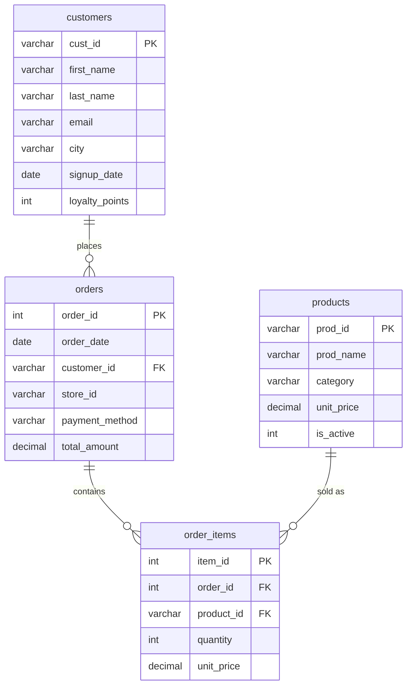

# Dataset: Brew & Co. Coffee Shop (Beginner)

## Business context

**Brew & Co.** is a small regional coffee shop chain with **3 locations** (stores BRW001/002/003). Customers join a loyalty program at signup and earn loyalty points per visit. Each customer order is recorded at a register with a payment method, and order lines capture the exact menu items bought.

This is a deliberately simple, single-business dataset: one store dimension (as `store_id`), one product menu, customers, orders, and order line items. There is **no** multi-table joining beyond `orders → customers` and `order_items → products`, which makes it ideal for beginner SELECT/WHERE/GROUP BY practice.

## Tables & row counts

| Table           | Rows  | Purpose                            | Key columns                                                                                          |
| --------------- | ----- | ---------------------------------- | ---------------------------------------------------------------------------------------------------- |
| `products`    | 31    | Menu items with category and price | `prod_id`, `prod_name`, `category`, `unit_price`, `is_active`                              |
| `customers`   | 350   | Loyalty program members            | `cust_id`, `first_name`, `last_name`, `email`, `city`, `signup_date`, `loyalty_points` |
| `orders`      | 1,200 | Customer purchases at a store      | `order_id`, `order_date`, `customer_id`, `store_id`, `payment_method`, `total_amount`    |
| `order_items` | 3,647 | Line items per order               | `item_id`, `order_id`, `product_id`, `quantity`, `unit_price`                              |

## Entity Relationship Diagram (ERD)

### Relationship Summary

| Relationship                    | Type        | Description                             |
| ------------------------------- | ----------- | --------------------------------------- |
| `customers` → `orders`     | One-to-Many | A customer can place many orders        |
| `orders` → `order_items`   | One-to-Many | An order contains multiple line items   |
| `products` → `order_items` | One-to-Many | A product can appear in many line items |

### Join Hints

- `orders.customer_id` → `customers.cust_id` (who ordered what)
- `order_items.order_id` → `orders.order_id` (items inside an order)
- `order_items.product_id` → `products.prod_id` (product details for an item)

## Data notes (read before solving)

- **Date range:** orders run from **2025-01-02** to **2026-01-30**; customers signed up 2022–2025.
- **Stores:** BRW001 (Manhattan), BRW002 (Brooklyn), BRW003 (Queens) — distributed ~evenly (~400 orders each).
- **Payment methods:** `Card` (~47%), `Cash` (~33%), `Mobile Pay` (~17%). About **37 orders have `payment_method = NULL`** (missing value on purpose — good for `IS NULL` practice).
- **Menu:** 3 categories (`Beverage`, `Food`, `Merchandise`). Two products are inactive (`is_active = 0`).
- **Prices:** beverages ~$2.95–$16.00, food ~$2.50–$9.50, merchandise ~$4.00–$35.00.
- **Consistency:** `orders.total_amount` always equals the sum of that order's line items (`quantity × unit_price`), so revenue can be computed either way.
- **Loyalty points:** 0–12,000 per customer; some customers have **no orders at all** (18 customers).

## MySQL vs SQLite

- `retail.sql` — MySQL 8.x DDL + INSERT (load with `mysql < retail.sql`).
- `retail.db` — SQLite copy, used to verify the expected results in `01-beginner/challenges.md` (open in DB Browser for SQLite or with the `sqlite3` CLI).
