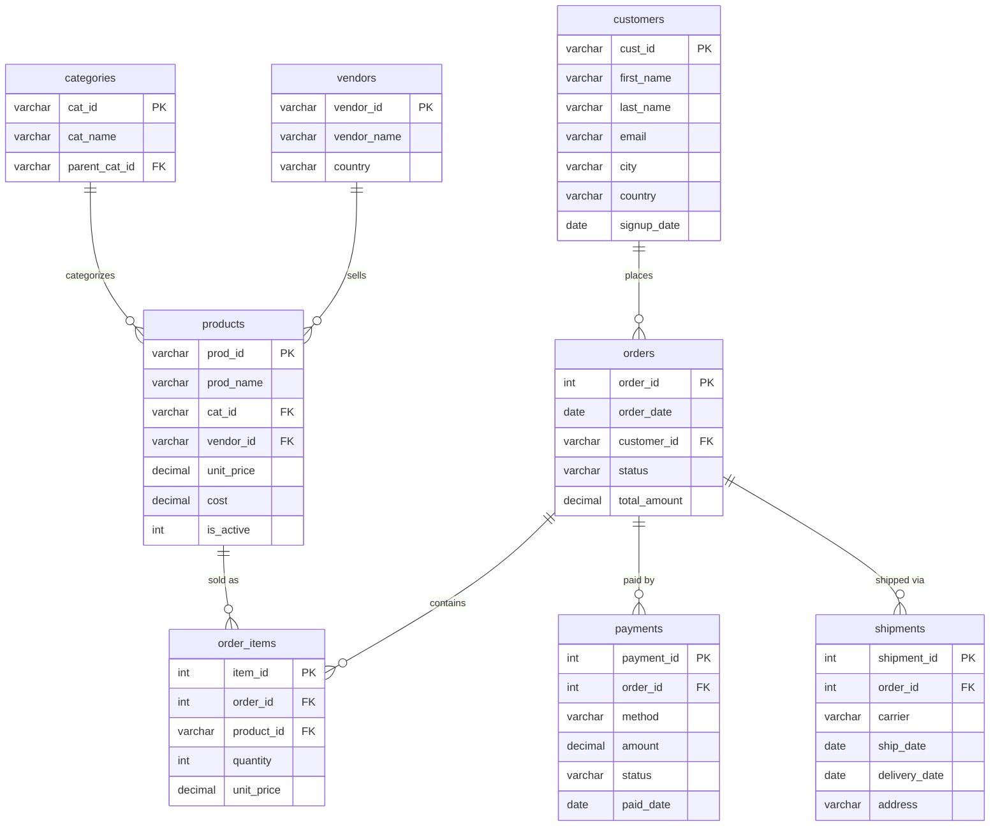

# Dataset: Online Marketplace (Intermediate)

## Business context

**MarketHub** is an e-commerce marketplace where **multiple vendors** list products. Customers browse a category hierarchy (parent + subcategories), place orders, pay via several payment methods, and completed orders are shipped by a courier. A realistic order lifecycle is modeled across 8 tables: catalog → order → payment → shipment.

This dataset is designed for **intermediate** practice: JOINs across 3–4 tables, GROUP BY with HAVING, date functions, subqueries, CTEs, CASE/conditional aggregation, and basic window functions (ROW_NUMBER, running totals).

## Tables & row counts

| Table           | Rows  | Purpose                                    | Key columns                                                                                    |
| --------------- | ----- | ------------------------------------------ | ---------------------------------------------------------------------------------------------- |
| `categories`  | 16    | Category tree (8 parents, 8 subcategories) | `cat_id`, `cat_name`, `parent_cat_id`                                                    |
| `vendors`     | 14    | Marketplace sellers                        | `vendor_id`, `vendor_name`, `country`                                                    |
| `products`    | 120   | Items sold by vendors                      | `prod_id`, `prod_name`, `cat_id`, `vendor_id`, `unit_price`, `cost`, `is_active` |
| `customers`   | 500   | Marketplace buyers                         | `cust_id`, `first_name`, `last_name`, `email`, `city`, `country`, `signup_date`  |
| `orders`      | 2,800 | Purchase orders                            | `order_id`, `order_date`, `customer_id`, `status`, `total_amount`                    |
| `order_items` | 7,102 | Line items per order                       | `item_id`, `order_id`, `product_id`, `quantity`, `unit_price`                        |
| `payments`    | 2,283 | Payment attempts per order                 | `payment_id`, `order_id`, `method`, `amount`, `status`, `paid_date`                |
| `shipments`   | 1,864 | Courier shipments                          | `shipment_id`, `order_id`, `carrier`, `ship_date`, `delivery_date`, `address`      |

## Entity Relationship Diagram (ERD)

### Relationship Summary

| Relationship                     | Type             | Description                                                        |
| -------------------------------- | ---------------- | ------------------------------------------------------------------ |
| `categories` → `products`   | One-to-Many      | A category contains many products (products live in subcategories) |
| `categories` → `categories` | Self-referencing | `parent_cat_id` links a subcategory to its top-level parent      |
| `vendors` → `products`      | One-to-Many      | A vendor sells many products                                       |
| `customers` → `orders`      | One-to-Many      | A customer places many orders                                      |
| `orders` → `order_items`    | One-to-Many      | An order contains multiple line items                              |
| `products` → `order_items`  | One-to-Many      | A product can appear in many line items                            |
| `orders` → `payments`       | One-to-Many      | An order can have payment attempts                                 |
| `orders` → `shipments`      | One-to-Many      | A shipped order can have shipments                                 |

### Join Hints

- `orders.customer_id` → `customers.cust_id` (buyer details per order)
- `order_items.order_id` → `orders.order_id`, `order_items.product_id` → `products.prod_id` (revenue per product)
- `products.cat_id` → `categories.cat_id`, `products.vendor_id` → `vendors.vendor_id` (category/vendor rollups)
- `payments.order_id` / `shipments.order_id` → `orders.order_id` (payment + fulfillment status)

## Data notes (read before solving)

- **Order lifecycle:** `status` is one of `Completed` (1,388), `Shipped` (476), `Pending` (480), `Cancelled` (456). Cancelled orders have no payment/shipment.
- **Order date range:** **2025-01-01** to **2026-01-31**.
- **Payments:** methods `Card`, `PayPal`, `Bank Transfer`, `COD`; statuses `Paid` (1,348), `Failed` (482), `Refunded` (453). **517 orders have no payment row at all**.
- **Shipments:** carriers `UPS`, `FedEx`, `DHL`, `USPS`. **95 shipments have `delivery_date = NULL`** (still in transit).
- **Products:** 9 products are inactive (`is_active = 0`) but some were still sold before being discontinued — a realistic "discontinued but ordered" case.
- **Categories:** 8 top-level categories each with 1–2 subcategories (`parent_cat_id`); products belong to subcategories.
- **Consistency:** `orders.total_amount` = sum of its `order_items` (`quantity × unit_price`). Payments mostly match the order total.
- **Prices:** ~$5–$1,200, so order totals range from small to several thousand dollars. Average order value ≈ $2,996.

## MySQL vs SQLite

- `ecommerce.sql` — MySQL 8.x DDL + INSERT (load with `mysql < ecommerce.sql`).
- `ecommerce.db` — SQLite copy, used to verify the expected results in `02-intermediate/challenges.md`.
