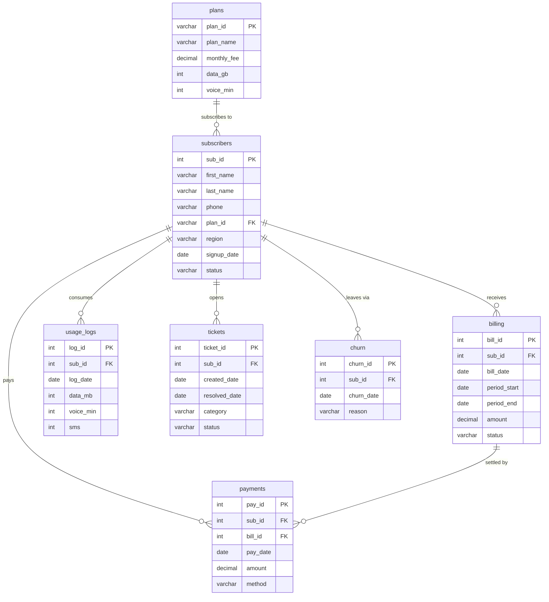

# Dataset: Mobile Telecom Carrier (Advanced)

## Business context

**NovaTel** is a mobile telecom carrier. Subscribers pick a plan (data allowance + voice minutes), receive a **monthly bill**, pay it via several methods, and consume data/voice/SMS each month (logged in `usage_logs`). Subscribers open **support tickets** when they have problems, and some eventually **churn** (cancel). This is a rich, realistic subscription business with time-series data, payments, support, and churn — perfect for **advanced** SQL: window functions (LAG/LEAD, NTILE, moving averages), correlated subqueries, recursive CTEs, set operations, pivots, and cohort analysis.

## Tables & row counts

| Table | Rows | Purpose | Key columns |
| --- | --- | --- | --- |
| `plans` | 6 | Subscription plans | `plan_id`, `plan_name`, `monthly_fee`, `data_gb`, `voice_min` |
| `subscribers` | 4,500 | Customer accounts | `sub_id`, `first_name`, `last_name`, `phone`, `plan_id`, `region`, `signup_date`, `status` |
| `billing` | 7,996 | Monthly bills (2 cycles) | `bill_id`, `sub_id`, `bill_date`, `period_start`, `period_end`, `amount`, `status` |
| `payments` | 6,588 | Bill payments | `pay_id`, `sub_id`, `bill_id`, `pay_date`, `amount`, `method` |
| `usage_logs` | 7,418 | Monthly data/voice/SMS usage | `log_id`, `sub_id`, `log_date`, `data_mb`, `voice_min`, `sms` |
| `tickets` | 3,800 | Support tickets | `ticket_id`, `sub_id`, `created_date`, `resolved_date`, `category`, `status` |
| `churn` | 427 | Subscribers who cancelled | `churn_id`, `sub_id`, `churn_date`, `reason` |

## Entity Relationship Diagram (ERD)

### Relationship Summary

| Relationship | Type | Description |
|--------------|------|-------------|
| `plans` → `subscribers` | One-to-Many | A plan is held by many subscribers |
| `subscribers` → `billing` | One-to-Many | A subscriber receives monthly bills |
| `subscribers` → `payments` | One-to-Many | A subscriber makes payments |
| `billing` → `payments` | One-to-Many | A bill is settled by payments |
| `subscribers` → `usage_logs` | One-to-Many | A subscriber has monthly usage logs |
| `subscribers` → `tickets` | One-to-Many | A subscriber opens support tickets |
| `subscribers` → `churn` | One-to-Many | A subscriber can have one churn record |

### Join Hints

- `subscribers.plan_id` → `plans.plan_id` (plan name/fee per subscriber)
- `billing.sub_id` → `subscribers.sub_id` (bill → subscriber → plan for revenue-by-plan)
- `payments.bill_id` → `billing.bill_id` and `payments.sub_id` → `subscribers.sub_id` (payment ↔ bill matching)
- `tickets.sub_id` / `churn.sub_id` / `usage_logs.sub_id` → `subscribers.sub_id` (support, churn, usage analysis)

## Data notes (read before solving)

- **Plans:** `Starter $20`, `Standard $35`, `Plus $50`, `Premium $70`, `Family $90`, `Unlimited Max $120`. Plan fee = monthly bill amount.
- **Subscriber status:** `Active` (3,709), `Suspended` (364), `Cancelled` (427). Signup dates 2021–2025.
- **Regions:** Northeast, Southeast, Midwest, Southwest, West (~even distribution).
- **Billing cycles:** two — `bill_date 2025-12-01` (4,287 bills) and `2026-01-01` (3,709 bills). Active subscribers have both; suspended/cancelled subscribers have fewer. Bill statuses: `Paid` (6,588), `Unpaid` (765), `Overdue` (643).
- **Payments:** methods `Card`, `Auto-Pay`, `Bank Transfer`, `Wallet`. Every `Paid` bill has a matching payment; 216 subscribers were billed but **never paid**.
- **Usage:** one log per active subscriber per billing month (`data_mb` 0–30,000, `voice_min` 0–1,500, `sms` 0–300). ~30 GB/month is typical; several subscribers **exceed their plan's allowance**.
- **Tickets:** categories `Billing`, `Technical`, `Network`, `Account`, `Device`; statuses `Open`, `Resolved`, `Closed`. **1,149 tickets have `resolved_date = NULL`** (still open). Tickets span 2025-06 to 2026-01.
- **Churn:** reasons include `Price`, `Coverage`, `Service Quality`, `Moving`, `Competitor Offer`, `Other`. Some churned subscribers **still have unpaid bills**.

## MySQL vs SQLite

- `telecom.sql` — MySQL 8.x DDL + INSERT (load with `mysql < telecom.sql`).
- `telecom.db` — SQLite copy, used to verify the expected results in `03-advanced/challenges.md`.
