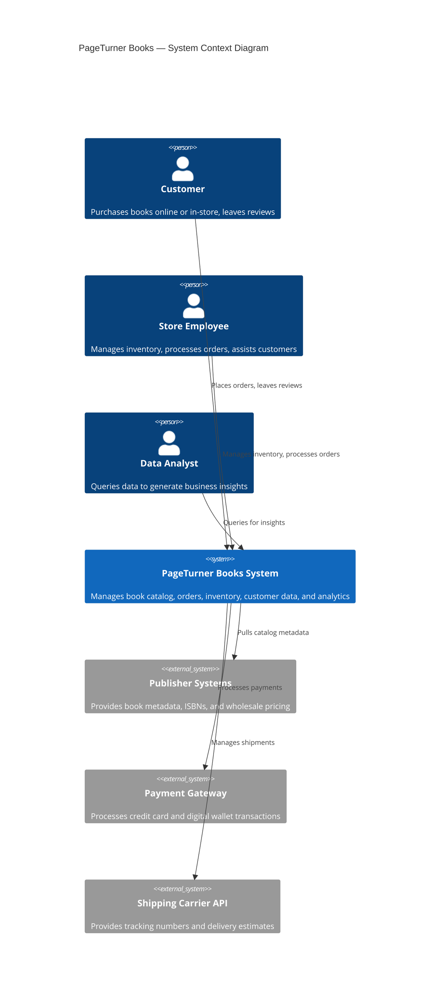
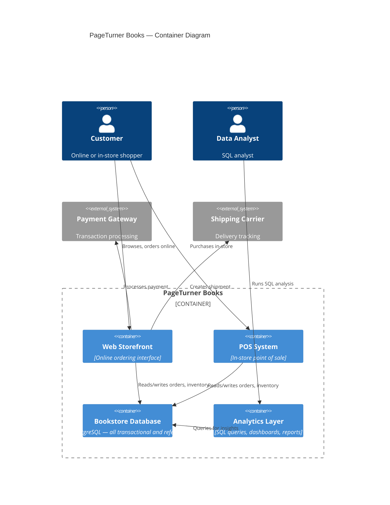
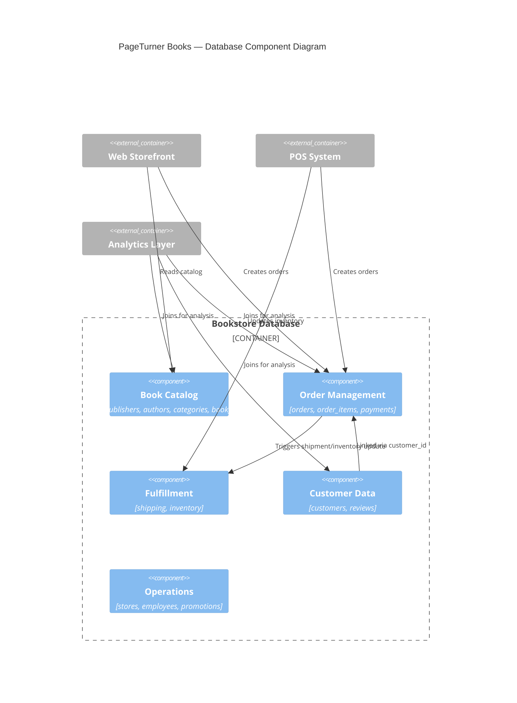
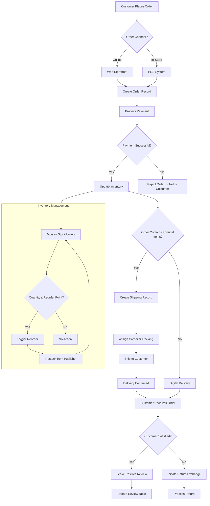
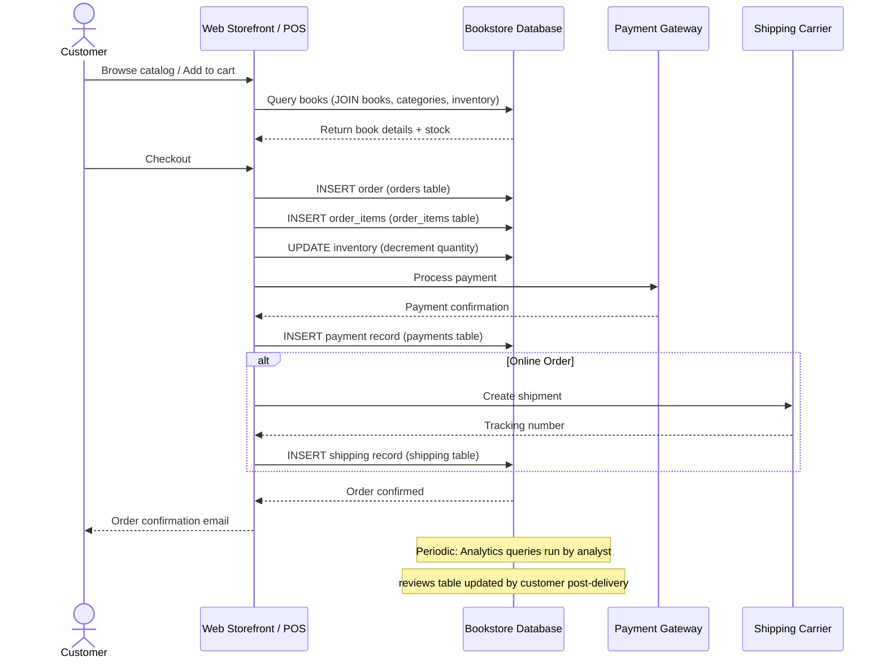
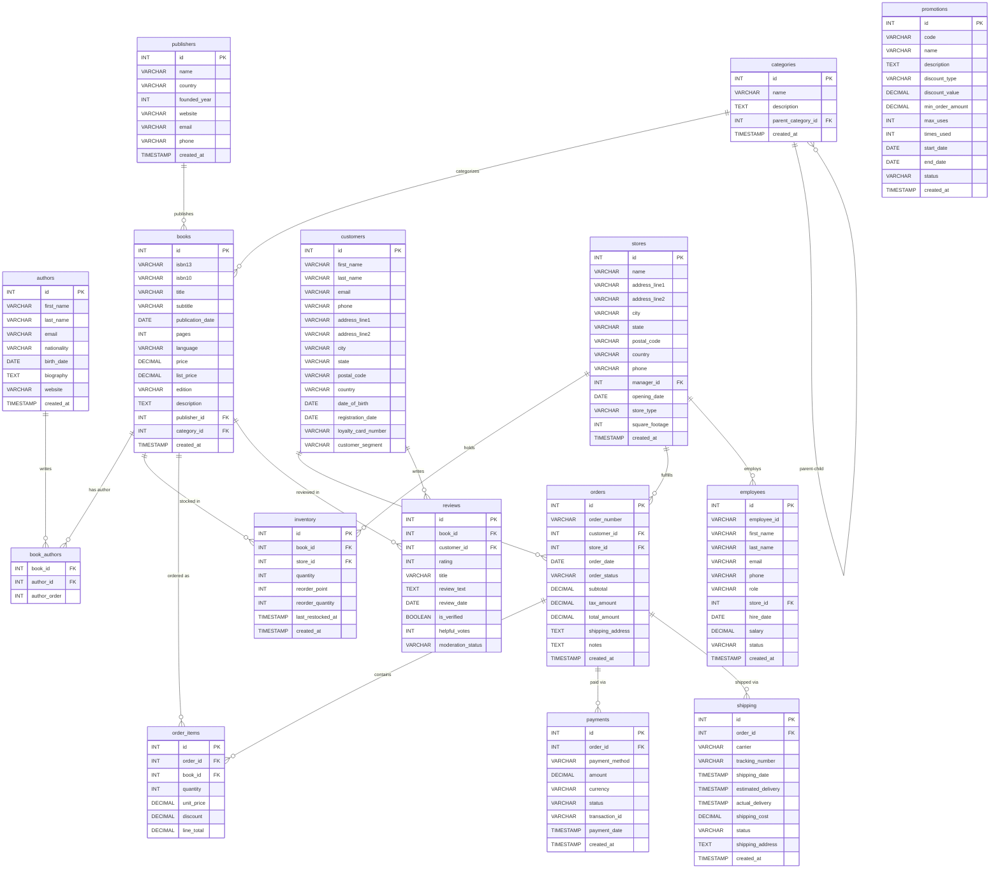

# System Analysis Document (SAD) — PageTurner Books

**Dataset**: `data/02-bookstore/`
**Generated by**: case-generator
**Date**: 2026-09-03

---

## 1. C4 Architecture Diagram

### Level 1 — System Context

### Level 2 — Container Diagram

### Level 3 — Component Diagram (Database Layer)

---

## 2. Business Process Flowchart

---

## 3. Sequence Diagram — Order Lifecycle

---

## 4. Entity Relationship Diagram (ERD)

---

## 5. Key Design Observations

| Aspect                            | Observation                                                                                                                                            |
| --------------------------------- | ------------------------------------------------------------------------------------------------------------------------------------------------------ |
| **Channel inference**       | `orders.store_id` is the de facto channel indicator: NULL = online, non-NULL = physical store. A dedicated `channel` column would improve clarity. |
| **Many-to-many**            | `book_authors` links books to authors with ordering (`author_order`), supporting co-authored works.                                                |
| **Hierarchical categories** | `categories.parent_category_id` self-references for genre/sub-genre hierarchy (e.g., "Fiction" → "Literary Fiction").                               |
| **No direct promo linkage** | `promotions` are not linked to `orders` via FK. Analyst must infer promotional impact through discount patterns or temporal analysis.              |
| **Employee-store link**     | `employees.store_id` links staff to locations; `stores.manager_id` references an employee as store manager.                                        |
| **Date format risk**        | Multiple date formats across the dataset require careful parsing before time-series analysis.                                                          |
