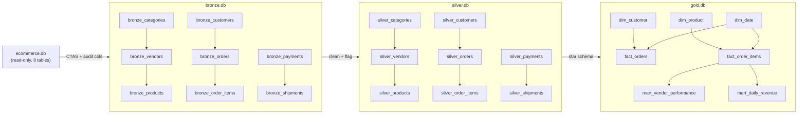

# Medallion Architecture Study Case — MarketHub

**Module:** Data Warehouse Architecture (`learning/05-dwh-architecture/`) · **Dataset:** `sql-skill-push/datasets/02-intermediate/ecommerce.db` (read-only, reused)
**Pipeline:** `script/02-python/medallion_pipeline.py` · **Per-layer SQL:** `script/01-sql/medallion/01-bronze.sql`, `02-silver.sql`, `03-gold.sql`

This case turns the **Medallion architecture** (bronze → silver → gold) into a concrete, reproducible pipeline. It is the hands-on version of what the Data Engineering roadmap describes in **Week 3** (star schema design) and **Week 4** (raw → staging → analytics pipeline), and it is where the **Data Quality Engineer** track's discipline shows up as real cleaning logic.

---

## 1. Dataset profile

MarketHub is a multi-vendor marketplace captured in 8 tables over **2025-01-01 → 2026-01-31** (verified against the [dataset README](../../02-sql-learning/sql-skill-push/datasets/02-intermediate/README.md)):

| Table | Rows | Key quirks |
| --- | --- | --- |
| `categories` | 16 | 8 top-level + 8 subcategories (parent/child tree) |
| `vendors` | 14 | Countries incl. abbreviations `UK`, `USA` |
| `products` | 120 | 9 inactive (`is_active=0`) but still sold |
| `customers` | 500 | Clean PKs, no dupes |
| `orders` | 2,800 | statuses: Cancelled 456 / Completed 1,388 / Shipped 476 / Pending 480 |
| `order_items` | 7,102 | line items; `total_amount` = Σ(quantity × unit_price) |
| `payments` | 2,283 | Paid 1,348 / Failed 482 / Refunded 453; **517 orders have no payment row** |
| `shipments` | 1,864 | **95 have `delivery_date IS NULL`** (in transit) |

---

## 2. Layer mapping

| Layer | DB file | Tables | Purpose |
| --- | --- | --- | --- |
| 🥉 **Bronze** | `bronze.db` | `bronze_<name>` (8) | Raw, immutable copies + audit columns `_ingest_ts`, `_source_table`. Row counts must equal source exactly. |
| 🥈 **Silver** | `silver.db` | `silver_<name>` (8) | Cleaned, conformed, one row per source row, DQ flags + `_quality_issues`. |
| 🥇 **Gold** | `gold.db` | `dim_customer`, `dim_product`, `dim_date`, `fact_order_items`, `fact_orders`, `mart_vendor_performance`, `mart_daily_revenue` | Star schema + marts ready for reporting. |

### Mermaid lineage



---

## 3. Data-quality decisions (the silver layer)

Each flag below exists because a specific quirk in the source data needs to be *visible*, not silently fixed. This is the `dq` track's "understand → measure → flag" discipline in a pipeline.

| DQ flag | Where | Quirk it addresses | Count (asserted) |
| --- | --- | --- | --- |
| `is_valid_order` | `silver_orders` | Cancelled orders should not count as revenue | 456 cancelled → flag `0` |
| `has_payment` | `silver_orders` | 517 orders have **no payment row** at all | 517 → flag `0` |
| `is_payment_complete` | `silver_payments` | Paid vs Failed/Refunded + amount must match order total | 1,348 complete |
| `in_transit` | `silver_shipments` | `delivery_date IS NULL` should mean "in transit", not a missing value | 95 → flag `1` |
| `is_discontinued_but_sold` | `silver_products` | inactive product that still appears in `order_items` (historical order) | 9 |
| `parent_cat_name` | `silver_categories` | flatten the category tree (self-join) | 8 subcats get parent names |
| `country` (standardized) | `silver_vendors` | `UK`→`United Kingdom`, `USA`→`United States` | 3 rows flagged |
| `full_name`, lowercased email | `silver_customers` | trim + dedup by natural key | 500 (no dupes found) |
| `line_revenue` | `silver_order_items` | `quantity × unit_price` at line grain | 7,102 rows |

Every row carries a `_quality_issues` column: `NULL` when clean, comma-delimited tags when flagged — so quality problems stay queryable downstream.

---

## 4. Gold layer — the star schema

- **`dim_date` is generated** (396 rows, full 2025-01-01 → 2026-01-31 range) — not copied from any source table. Attributes: `year`, `month`, `day`, `day_of_week`, `is_weekend`, `quarter`.
- **`fact_order_items`** — line grain, **7,102 rows**, joins to `dim_customer` / `dim_product` / `dim_date`.
- **`fact_orders`** — order grain, **2,800 rows**, one per source order, keeps `is_valid_order` and `has_payment`.
- **`mart_vendor_performance`** — 14 rows (all vendors have sales), e.g. top revenue vendor VEN001 (603 orders, $733,690.24 gross).
- **`mart_daily_revenue`** — 396 rows, e.g. peak day 2025-08-17 ($52,193.50, 14 orders), built from valid (non-cancelled) lines.

---

## 5. Trade-offs

1. **Three separate `.db` files vs a single database with schema prefixes.** Separate files physically isolate the layers (like real Medallion storage separation) and force explicit `ATTACH DATABASE` cross-DB joins — a genuine DE skill. Cost: slightly more orchestration plumbing.
2. **Python stdlib vs dbt.** The roadmap's Weeks 5–8 use dbt (staging → intermediate → marts). This case reproduces the same layering discipline with stdlib `sqlite3` so it runs anywhere with zero setup; the mapping to dbt is conceptual, not syntactic.
3. **One row per source row in silver.** Keeps silver auditable against bronze (row-count equality). Alternative: pre-aggregate in silver, but that hides grain and complicates fact rebuilding.
4. **Flags vs throwing data away.** Cancelled orders, unpaid orders, and in-transit shipments are *kept and flagged* rather than deleted — a reporting choice can filter them (`is_valid_order = 1`), and an audit can still see them.

---

## 6. Mapping to the DE roadmap

| DE roadmap content | Where it appears in this case |
| --- | --- |
| Week 3: Star Schema fundamentals, `dim_customers`, `dim_products`, `fact_orders` | Gold layer: `dim_customer`, `dim_product`, `dim_date`, `fact_order_items`, `fact_orders` |
| Week 3: SCD Type 2 / partitioning | Not covered (out of scope; flat snapshot dimensions) |
| Week 4: raw → staging → analytics pipeline | Bronze → silver → gold, run by the orchestrator |
| Week 4: analytics tables (daily_revenue, product_performance) | `mart_daily_revenue`, `mart_vendor_performance` |
| Week 4: lineage documentation | This doc + the Mermaid lineage graph |
| Weeks 5–8: dbt staging → intermediate → marts | The layer boundaries map 1:1 onto staging/intermediate/marts mental model |

---

## 7. Running & verifying

```bash
# full pipeline (idempotent; gold run twice; no-data-loss check; exit 0 on success)
python script/02-python/medallion_pipeline.py

# single stage (rebuilds upstream first)
python script/02-python/medallion_pipeline.py --stage gold
```

Verified guarantees: bronze row counts == source (immutability), silver grain == bronze, gold facts 7,102 / 2,800, `dim_date` covers the order range, gold run 2 == run 1 (idempotency), and Completed+Shipped `total_amount` sum in gold ($5,548,140.62) equals the source sum exactly (no data loss). The source subtree under `sql-skill-push/` is never modified.

---

## 8. Optional: review with `@query-inspector`

The per-layer SQL scripts live in `script/01-sql/medallion/` and can be inspected by the `query-inspector` agent for query-logic correctness and business-requirement alignment. This is an optional usage note — the pipeline does not depend on it.
