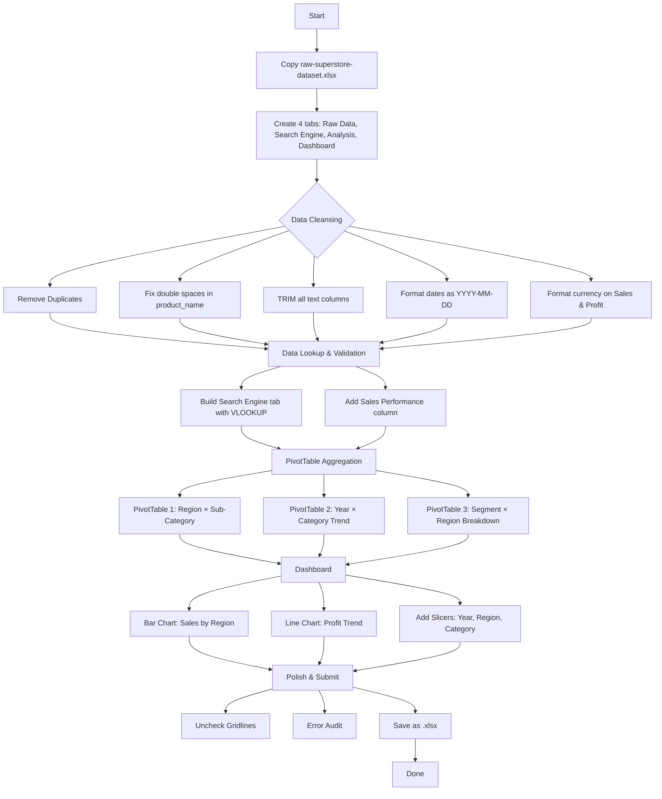
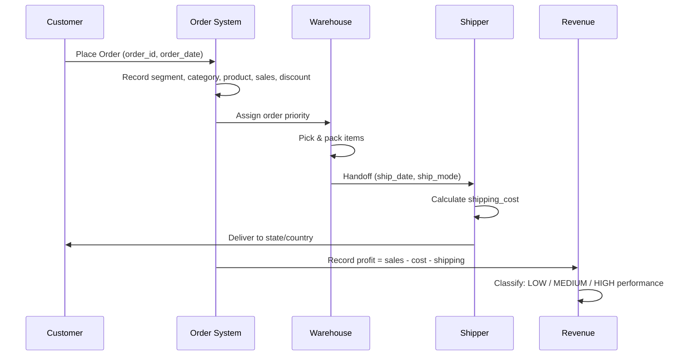
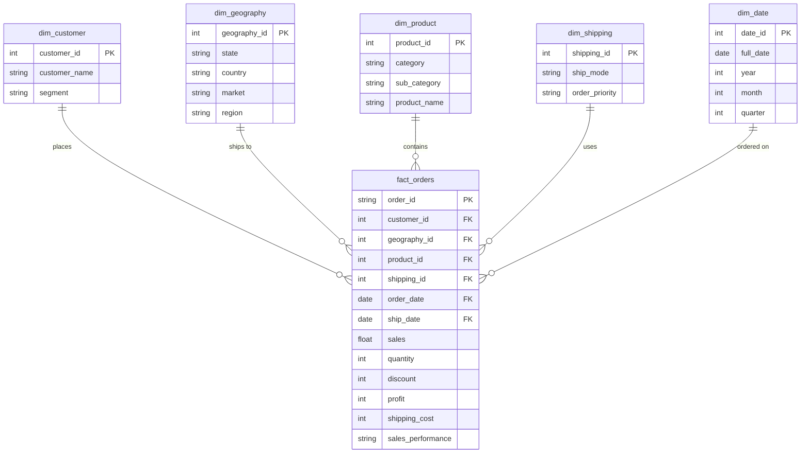

# Superstore Dataset — Comprehensive Execution Plan

Based on analysis of `raw-superstore-dataset.xlsx` and the `hard-skill-push.md` guide.

## Table Grain

> **Each row = one order line item (one product within one order).**

| Grain Aspect | Value |
|--------------|-------|
| **What each row represents** | A single product line in a customer's order |
| **Primary key** | `order_id` + `product_id` composite (not explicitly in dataset) |
| **One order can have** | Multiple rows (multiple products) — e.g. `CA-2014-100111` appears 14 times |
| **One row can have** | One product, one quantity, one sales amount, one profit value |
| **Aggregation level** | Aggregating by `order_id` collapses to order-level; aggregating by `product_id` collapses to product-level |

**Why grain matters for this project:**
- **PivotTables** must use `SUM` (not `AVERAGE` or `COUNT`) on sales/profit to avoid double-counting when rows share the same order
- **Profit Margin** calculated field (`Profit / Sales`) is valid at the line-item grain — each row has its own sales and profit
- **VLOOKUP** on `order_id` returns the **first match only** — if an order has multiple products, only the first product's data is returned (use INDEX/MATCH or XLOOKUP with array mode for full order lookup)
- **Deduplication** is safe — the dataset has 0 full-row duplicates, but `order_id` repeats across rows legitimately (different products in the same order)

---

## Dataset Analysis Summary

| Attribute | Value |
|-----------|-------|
| Rows | 51,290 |
| Columns | 21 |
| Date Range | 2011-01-01 to 2014-12-31 |
| Full Duplicates | 0 |
| Negative Profit | 12,543 rows (24.5%) |
| Sales = 0 | 1 row |
| Product names w/ double spaces | 7 products |
| Year distribution | 2011: 8,998 → 2014: 17,531 (growing) |

### Columns Overview

| Column | Type | Unique Values | Notes |
|--------|------|---------------|-------|
| order_id | str | 25,035 | No nulls, clean |
| order_date | datetime | 1,430 | Range: 2011–2014 |
| ship_date | datetime | 1,464 | Extends to 2015-01-07 |
| ship_mode | str | 4 | Standard Class dominant (60%) |
| customer_name | str | 795 | Top: Muhammed Yedwab (108 orders) |
| segment | str | 3 | Consumer (52%), Corporate (30%), Home Office (18%) |
| state | str | 1,094 | Top: California (2,001) |
| country | str | 147 | Top: US (9,994) |
| market | str | 7 | APAC, LATAM, EU, US, EMEA, etc. |
| region | str | 13 | Central (22%), South (13%), EMEA (10%) |
| product_id | str | 10,292 | No nulls |
| category | str | 3 | Office Supplies (61%), Technology (20%), Furniture (19%) |
| sub_category | str | 17 | Binders (12%), Storage (10%), Art (10%) |
| product_name | str | 3,788 | 7 products have double-space issue |
| sales | float | 2,239 | Range: 0–999 |
| quantity | int | 14 | Range: 1–14 |
| discount | int | 25 | Range: 0–602 (investigate — may need /100) |
| profit | int | 20,936 | Range: -91.6M to 87.3M |
| shipping_cost | int | 9,068 | Range: 0–93,357 |
| order_priority | str | 4 | Medium (57%), High (30%), Critical (8%), Low (5%) |
| year | int | 4 | 2011–2014 |

---

## Pre-Phase: Dataset Modeling & Context

### C4 — Context, Content, Constraints, Choices

| Dimension | Details |
|-----------|---------|
| **Context** | A retail superstore operating globally (7 markets, 13 regions, 147 countries) selling Office Supplies, Furniture, and Technology. The business is growing year-over-year (2011: ~9K orders → 2014: ~17.5K orders). The dataset captures the full order-to-ship lifecycle. |
| **Content** | 21 columns covering order identity, dates, shipping, customer, geography, product, financials (sales, profit, discount, shipping cost), and priority. 51,290 transactional rows. No nulls. No full-row duplicates. |
| **Constraints** | `discount` is integer (0–602), not percentage — verify interpretation. 1 row has `sales = 0` causing extreme profit margin. 24.5% of rows have negative profit (losses). `product_name` has 7 entries with double-space artifacts. No customer ID column — customer analysis relies on `customer_name` only. |
| **Choices** | **Cleansing:** TRIM all text, fix double-spaces, format dates/currency. **Lookup:** VLOOKUP with IFERROR on Order ID. **Analysis:** PivotTables with Profit Margin calculated field. **Dashboard:** Bar + Line charts with Year/Region/Category slicers. |

---

### Flowchart — End-to-End Process



---

### Sequence — Order Lifecycle



---

### ERD — Entity Relationship Diagram (Star Schema)



> **Note:** The raw dataset is a single flat table with all 21 columns. This star schema shows how it **would** be normalized in a proper data warehouse. For this Excel project, all data lives in one sheet — the ERD helps understand the logical relationships between fields.

**Key relationships:**
- `fact_orders` is the central fact table — each row is one order line item
- 5 dimension tables provide context (who, where, what, when, how shipped)
- `order_id` + `product_id` form the composite grain key
- One order can contain multiple products (one-to-many via `product_id`)

---

## Phase 1: Workbook Setup

1. Copy `raw-superstore-dataset.xlsx` → rename to `superstore-analysis.xlsx`
2. Create 4 tabs:
   - **Raw Data** — source dataset (untouched backup reference)
   - **Search Engine** — VLOOKUP/XLOOKUP tool
   - **Analysis** — PivotTables
   - **Dashboard** — final visualizations

---

## Phase 2: Data Cleansing (Task 1)

3. **Remove Duplicates** — Data tab → Remove Duplicates (verify 0 found, this dataset is clean)
4. **Fix double spaces in product_name** — 7 products have internal double spaces:
   - Use helper column: `=TRIM(CLEAN(SUBSTITUTE(product_name_cell, "  ", " ")))`
   - Copy results → Paste as Values over original `product_name` column
   - Affected products:
     - `Tyvek  Top-Opening Peel & Seel Envelopes, Plain White`
     - `Eldon Mobile Mega Data Cart  Mega Stackable  Add-On Trays`
     - `Avery Heavy-Duty EZD  Binder With Locking Rings`
     - `Eureka Sanitaire  Commercial Upright`
     - `Howard Miller 12-3/4 Diameter Accuwave DS  Wall Clock`
     - `Eureka Sanitaire  Multi-Pro Heavy-Duty Upright, Disposable Bags`
     - `Tyvek  Top-Opening Peel & Seel  Envelopes, Gray`
5. **Trim whitespace on all text columns** — add TRIM helper columns for:
   - `order_id`, `customer_name`, `product_name`, `state`, `country`
   - Paste as Values over originals, delete helper columns
6. **Format dates** — select `order_date` & `ship_date` → Right-click → Format Cells → Date → `YYYY-MM-DD`
7. **Format currency** — select `sales` & `profit` → Format Cells → Currency → choose symbol

---

## Phase 3: Data Lookup & Logical Validation (Task 2)

8. **Search Engine tab setup:**
   - Cell A1: `Order ID`
   - Cell B2: input cell for Order ID to search
   - Row labels in A3:A10: Customer Name, Segment, State, Country, Category, Sub-Category, Sales, Profit

9. **VLOOKUP formulas** (in B3:B10):
   ```
   =IFERROR(VLOOKUP($B$2, 'Raw Data'!$A:$Z, 5, FALSE), "Not Found")   // customer_name (col 5)
   =IFERROR(VLOOKUP($B$2, 'Raw Data'!$A:$Z, 6, FALSE), "Not Found")   // segment (col 6)
   =IFERROR(VLOOKUP($B$2, 'Raw Data'!$A:$Z, 7, FALSE), "Not Found")   // state (col 7)
   =IFERROR(VLOOKUP($B$2, 'Raw Data'!$A:$Z, 8, FALSE), "Not Found")   // country (col 8)
   =IFERROR(VLOOKUP($B$2, 'Raw Data'!$A:$Z, 12, FALSE), "Not Found")  // category (col 12)
   =IFERROR(VLOOKUP($B$2, 'Raw Data'!$A:$Z, 13, FALSE), "Not Found")  // sub_category (col 13)
   =IFERROR(VLOOKUP($B$2, 'Raw Data'!$A:$Z, 15, FALSE), "Not Found")  // sales (col 15)
   =IFERROR(VLOOKUP($B$2, 'Raw Data'!$A:$Z, 17, FALSE), "Not Found")  // profit (col 17)
   ```

10. **Sales Performance column** — add column U to Raw Data:
    ```
    =IF(O2<100, "LOW", IF(O2<500, "MEDIUM", "HIGH"))
    ```
    *(Assumes sales is column O — adjust index as needed)*

11. **Verify:** Test with known Order ID (e.g., `AG-2011-2040`) and an invalid one to confirm "Not Found" works

---

## Phase 4: PivotTable Aggregation (Task 3)

12. **Create PivotTable 1 — Regional Performance:**
    - Source: Raw Data entire range
    - Destination: Analysis tab
    - **Rows:** Region → Sub-Category
    - **Values:** Sum of Sales, Sum of Profit

13. **Add Calculated Field — Profit Margin:**
    - Click in PivotTable → PivotTable Analyze → Fields, Items, & Sets → Calculated Field
    - Name: `Profit Margin`
    - Formula: `=Profit / Sales`
    - Right-click column → Number Format → Percentage

14. **Create PivotTable 2 — Year-over-Year Trend:**
    - **Rows:** Year
    - **Columns:** Category
    - **Values:** Sum of Sales, Sum of Profit

15. **Create PivotTable 3 — Segment Breakdown:**
    - **Rows:** Segment
    - **Columns:** Region
    - **Values:** Sum of Sales, Count of Order ID

---

## Phase 5: Interactive Dashboard (Task 4)

16. **Bar Chart** — from PivotTable 1:
    - Select Region + Sales data → Insert → PivotChart → Clustered Bar
    - Title: "Sales by Region & Sub-Category"

17. **Line Chart** — from PivotTable 2:
    - Select Year + Profit data → Insert → PivotChart → Line with Markers
    - Title: "Profit Trend by Year & Category"

18. **Insert Slicers** (connected to PivotTables):
    - Slicer 1: Year
    - Slicer 2: Region
    - Slicer 3: Category
    - Right-click slicer → Report Connections → connect to all 3 PivotTables

19. **Move to Dashboard tab:**
    - Cut (Ctrl+X) charts and slicers → Paste (Ctrl+V) to Dashboard
    - Arrange: slicers at top, charts below, aligned evenly

---

## Phase 6: Polish & Submit (Task 5)

20. **Dashboard aesthetics:**
    - View tab → Uncheck **Gridlines**
    - Optional: add a title cell at top, bold, larger font

21. **Error audit:**
    - Test Search Engine with invalid Order ID → verify "Not Found" (no `#N/A` errors)
    - Check all PivotTable values are reasonable
    - Verify Profit Margin calculated field shows as percentage

22. **Final save** as `superstore-analysis.xlsx`

---

## Data Quality Notes

- **discount column** is stored as integer (0–602), not decimal/percentage. Verify if this is intentional or needs conversion (`=discount/100`).
- **1 row has sales = 0** — causes extreme profit margin values. Consider filtering or flagging.
- **12,543 rows (24.5%) have negative profit** — these are losses, expected in business data.
- **No full-row duplicates** found — dataset is clean on this front.
